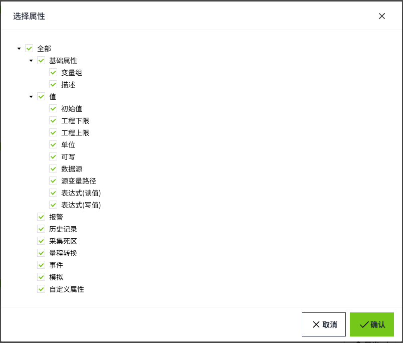

# 批量更新

在模型或者实例页面下，批量创建数据后，可以对变量的详细设置进行更新。例如变量的报警配置、变量绑定的数据源路径等。

#### 导出变量

1. 在模型或实例的批量操作窗口中，点击“批量操作”按钮。

    

    

2. 在批量操作弹窗中，点击”导出变量“按钮。

    

3. 点击后，会弹出变量选择器，将需要导出的变量加入到”选中列表“。如果选择的是目录或者实例，则表示选中该目录或实例节点（包含当前节点及其所有子节点）下的所有变量。目录和实例选中后，以*表示其下所有变量。

    

4. 点击”确认“按钮，弹出属性选择窗口，可以选择需要的变量属性进行导出。导出文件为excel格式。导出的Excel中内容解析请参考[known-link] 。

    

#### 导入变量

导出的变量文件修改完成后，在批量操作弹窗中，点击”导入变量“按钮，将变量导入。

**注意：**

- 该操作会通过Excel中的路径列的数据匹配资产中的变量，覆盖变量的配置，不支持新增和删除；
- 不需要更新的配置，可在Excel中删除对应列，或者将对应的列的值设置为空；
- 由模型引用过来的变量，在进行导入变量配置操作时，会对修改的配置进行重写。

  

# 变量配置Excel

变量配置表格中包含了变量的所有配置项（名称和数据类型除外），用户在导出变量配置后，修改表格内容，再导入变量配置，可实现变量配置的批量更新。

其中部分配置为复杂配置，在实际的存储时会是一个复杂的对象，在变量配置Excel中，我们采用了一种有规律的字符串来简化它：*Key1=Value1,Key2=Value2,Key3=Value3*。

**举个例子**：

需要在一列中同时配置**Name**，**Age**，**Address**三个字段的值时，则只需要在单元格填入*Name=Tom,Age=18,Address=Unknow*即可。

复杂对象为集合的情况，则只需要将多个对象字符串以”;“分隔即可，如：

*Name=Tom,Age=18,Address=Unknow;Name=Peter,Age=19,Address=Unknow*

**注意**：复杂配置中的Key和Value值不支持'='

在下列表格里，如遇到复杂配置，将在描述中首先注释为”复杂配置“或”复杂集合配置“。

| **分类**         | **列名**                 | **描述** |
|:------------------|:--------------------------|:------------------------------------------------------------------------------------------------------------------------------------------------------------------------------------------------------------------------------------------------------------------------------------------------------------------------------------------------------------------------------------------------------------------------------------------------------------------------------------------------------------------------------------------------------------------------------------------------------------------------------------------------------------------------------------------------------------------------------------------------------------------------------------------------------------------------------------------------------------------------------------------------------------------------------------------------------------------------------------------------------------------------------------------------------------------------------------------------------------------------------------------------------------------------------------------------------------------------------------------------------------------------------------------------------------------------------------------------------------------------------------------------------------------------------------------------------------------------------------------------------------------------------------------------------------------------------------------------------------------------------------------------------------------------------------------------------------------------------------------------------------------------------------------------------------------------------------------------------------------------------------------------------------------------------------------------------------------------------------------------------------------------------------------------------------------------------------------------------------------------------------------------------------------------------------------------------------------------------------------------------------------------------------------------------------------------------------------------------------------------------------------------------------------------------------------------------------------------------------------------------------------------------------------------------------------------------------------------------------------------------------------------------------------------------------------------------------------------------------------------------------------------------------------------------------------------------------------------------------------------------------------------------------------------------------------------------------------------------------------------------------------------------------------------------------------------------------------------------------------------------------------------------------------------------------------------------------------------------------------------------------------------------------------------------------------------------------------------------------------------------------------------------------------------------------------------------------------------------------------------------------------------------------------------------------------------------------------------------------------------------------------------------------------------------------------------------------------------------------------------------------------------------------------------------------------------------------------------------------------------------------------------------------------------------------------------------------------------------------------------------------------------------------------------------------------------------------------------------------------------------------------------------------------------------------------------------------------------------------------------------------------------------------------------------------------------------------------------|
| 路径             | 路径                     | 变量的完整路径，在导入变量配置时，系统将根据路径匹配资产中的变量 |
| 基础配置         | 描述                     | 变量的描述配置，用户可根据需要填入任意字符串。|
|                  | 变量组                   | 变量的变量组配置，修改时需与变量组列表中的名称对应，否则会导致变量功能失效。|
|                  | 初始值                   | 初始化变量时，推送的默认值，修改时需考虑变量的类型，如Double类型的变量，不可将此值改为字符串。|
|                  | 工程下限                 | 数值型变量理论最小值，其它类型的变量填入不生效，与工程上限配对使用，会参与变量的运算。|
|                  | 工程上限                 | 数值型变量理论最大值，其它类型的变量填入不生效，与工程下限配对使用，会参与变量的运算。|
|                  | 单位                     | 数值型变量可配置，可自定义输入字符串。|
|                  | 可写                     | 输入True或者False，用于配置该变量时候可写。|
| I/O变量数据源    | 数据源                   | I/O变量可配置，绑定具体的设备数据源。   填写规则请参考[​I/O变量绑定数据源​](../../../tag/creating-tags/io-tag-binding-data-source.md)。 |
| 表达式变量数据源 | 源变量路径               | 表达式变量可配置， 可以直接输入变量Path或选择变量。只可填选一个变量。|
|                  | 表达式（读值）             | 只有表达式变量才显示该属性。必填，默认显示 {Source} ， {Source}代表源变量的值。可以将源变量通过表达式计算后获取的新值作为当前变量的读到的值。|
|                  | 表达式（写值）             | 只有表达式变量才显示该属性。必填，默认显示 {Value} ， {Value} 表示源原变量的原始值。此表达式确定应写入变量的值。 |
| 历史记录         | 历史记录开启             | 变量是否记录历史，可选填True或False。系统在更新变量的历史记录配置时，会以该列作为初始判断依据，也就是说，如果该列没有存在于导入文件中，系统将不会识别“历史记录”相关列中的数据更新到变量。  在导出时，表格中的列会存在所有“历史记录”相关列，如在导入时需要更新历史记录，请确保“历史记录”相关列都存在于表格中，否则可能会导致配置错误。|
|                  | 历史记录模式             | 历史记录模式，可选填：  - Changed：变存 - Timer：周期存  |
|                  | 历史记录存储周期         | 当历史记录模式为Timer时，需要填写的存储周期。|
|                  | 历史记录存储周期单位     | 当历史记录模式为Timer时，需要填写的存储周期单位，与“历史记录存储周期”配合使用。  可选填：  - Milliseconds - Seconds - Minutes - Hours - Days - Weeks - Months - Years |
|                  | 历史记录压缩模式         | 历史记录存储压缩模式，可选填：  - Off：关闭 - Change：变化压缩 - Slope：斜率压缩 |
|                  | 历史记录压缩类型         | 当历史记录压缩模式为变化压缩时需要填写，可选填：  - Absolute：绝对值 - Percent：百分比 |
|                  | 历史记录值               | 当压缩模式选择变化压缩或斜率压缩时需要配置，填写 正数。|
|                  | 历史记录超时补值开启     | 当历史记录模式为变存时或历史记录模式为周期存且压缩模式不为Off时可配置，选填True或者False，代表开启或关闭。|
|                  | 历史记录超时补值间隔     | 当历史记录超时补值开启为True时需配置，填写任意正数。|
|                  | 历史记录超时补值间隔单位 | 当历史记录超时补值开启为True时需配置，补值间隔，配合历史记录超时补值间隔使用。  可选填：  - Milliseconds - Seconds - Minutes - Hours - Days - Weeks - Months - Years |
| 采集死区         | 死区开启                 | 变量是否开启采集死区，可选填True或False。系统在更新变量的采集死区配置时，会以该列作为初始判断依据，也就是说，如果该列没有存在于导入文件中，系统将不会识别“死区”相关列中的数据更新到变量。  在导出时，表格中的列会存在所有“死区”相关列，如在导入时需要更新采集死区，请确保“死区”相关列都存在于表格中，否则可能会导致配置错误。|
|                  | 死区模式                 | 采集死区判断模式，可选填：  - Absolute：绝对值 - Percent：百分比 |
|                  | 死区值                   | 采集死区判断死区范围具体值，填写正数。  - 当死区模式为Absolute，代表死区值； - 当死区模式为Percent，代表死区百分比，如填写1则为1%。 |
| 量程转换         | 量程转换开启             | 数值型或布尔型变量是否开启量程转换，可选填True或False。系统在更新变量的量程转换配置时，会以该列作为初始判断依据，也就是说，如果该列没有存在于导入文件中，系统将不会识别“量程转换”相关列中的数据更新到变量。  在导出时，表格中的列会存在所有“量程转换”相关列，如在导入时需要更新量程转换，请确保“量程转换”相关列都存在于表格中，否则可能会导致配置错误。|
|                  | 量程转换模式             | 量程转换计算方式，可选填：  Linear：线性，在变量类型为数值型时可选择  Square：开平方，在变量类型为数值型时可选择  Reverse：取反，在变量类型为布尔型时可选择 |
|                  | 量程转换最小值           | 当量程转换模式为Linear或Square需配置，参与量程转换的计算，填入任意数值。|
|                  | 量程转换最大值           | 当量程转换模式为Linear或Square需配置，参与量程转换的计算，填入大于量程转换最小值的任意数值。|
|                  | 量程转换最小原始值       | 当量程转换模式为Linear或Square需配置，参与量程转换的计算，填入任意数值。|
|                  | 量程转换最大原始值       | 当量程转换模式为Linear或Square需配置，参与量程转换的计算，填入大于量程转换最小原始值的任意数值。|
| 事件             | 事件开启                 | 变量是否开启事件，可选填True或False。系统在更新变量的事件配置时，会以该列作为初始判断依据，也就是说，如果该列没有存在于导入文件中，系统将不会识别“事件”相关列中的数据更新到变量。  在导出时，表格中的列会存在所有“事件”相关列，如在导入时需要更新事件，请确保“事件”相关列都存在于表格中，否则可能会导致配置错误。  |
|                  | 事件变量写值开启         | 可选填True或False，填写为True时，对该变量写值时会触发事件日志。 |
|                  | 事件变量写值日志         | 当事件变量写值开启为True时可配置，填入任意字符串。  |
|                  | 事件布尔值跳变开启       | 布尔类型变量可配置，可选填True或False，填写为True时，该布尔变量的值发生改变时，会触发事件日志。|
| 模拟             | 模拟开启                 | 变量是否开启模拟，可选填True或False。系统在更新变量的模拟配置时，会以该列作为初始判断依据，也就是说，如果该列没有存在于导入文件中，系统将不会识别“模拟”相关列中的数据更新到变量。  在导出时，表格中的列会存在所有“模拟”相关列，如在导入时需要更新模拟，请确保“模拟”相关列都存在于表格中，否则可能会导致配置错误。 |
|                  | 模拟类型                 | 模拟方式，可选填：  - Fixed：固定 - Random：随机，数值型、布尔型、字符型变量可选配 - Increment：递增，数值型变量可选配 - Decrement：递减，数值型变量可选配 - Reverse：取反，布尔型变量可选配 - Cycle：循环，字符型变量可选配 - CurrentTime：实时值，时间性变量可选配  |
|                  | 模拟初始值               | 当模拟类型为：Fixed、Random、Increment、Decrement、Reverse、Cycle时可配置，需要根据变量值类型填写对应类型的值，如数值型变量只可填写数值，否则更新后变量会发生运行错误。  |
|                  | 模拟最小值               | 当模拟类型为：Random、Increment、Decrement可配置，填入任意数值。|
|                  | 模拟最大值               | 当模拟类型为：Random、Increment、Decrement可配置，填入大于模拟最小值的任意数值。|
|                  | 模拟小数位               | 当模拟类型为：Fixed、Random、Increment、Decrement，且变量为Double类型时可配置，可填写0到16的数值。|
|                  | 模拟变化频率             | 当模拟类型为：Random、Increment、Decrement、Reverse、Cycle可配置，可填写一个正整数。 |
|                  | 模拟变化幅度             | 当模拟类型为：Increment、Decrement可配置，可填写任意数值。|
|                  | 模拟值                   | 当变量为String类型时，且模拟类型为：Cycle、Random时可配置，填入字符型变量模拟运算时使用的字符串，例如，需要模拟随机推送a,b,c，那么单元格内可填入“a,b,c”(不含双引号) |
| 自定义属性       | 自定义属性开启           | 变量是否开启自定义属性，可选填True或False。系统在更新变量的自定义属性配置时，会以该列作为初始判断依据，也就是说，如果该列没有存在于导入文件中，系统将不会识别“自定义属性”相关列中的数据更新到变量。  在导出时，表格中的列会存在所有“自定义属性”相关列，如在导入时需要更新自定义属性，请确保“自定义属性”相关列都存在于表格中，否则可能会导致配置错误。|
|                  | 自定义属性集合           | **复杂集合配置**  每个自定义属性存在2个字段需要填写：  - Key：自定义属性的名称 - Value：自定义属性值 |
| 报警             | 报警开启                 | 变量是否开启报警属性，可选填True或False。系统在更新变量的报警属性配置时，会以该列作为初始判断依据，也就是说，如果该列没有存在于导入文件中，系统将不会识别“报警”相关列中的数据更新到变量。  在导出时，表格中的列会存在所有“报警”相关列，如在导入时需要更新报警属性，请确保“报警”相关列都存在于表格中，否则可能会导致配置错误。|
|                  | 报警限值区间包含模式     | 当变量类型为数值型变量时可配置，可选填：  - Open：开区间 - Closed：闭区间 |
|                  | 报警限值延时             | **复杂配置**  当变量类型为数值型变量时可配置。  - ActiveDelayEnabled：开启激活延时 - ActiveDelay：激活延时时间(ms) - RecoveryDelayEnabled：开启恢复延时 - RecoveryDelay：恢复延时时间(ms)|
|                  | 报警变化率延时           | **复杂配置**  当变量类型为数值型变量时可配置。  - ActiveDelayEnabled：开启激活延时 - ActiveDelay：激活延时时间(ms) - RecoveryDelayEnabled：开启恢复延时 - RecoveryDelay：恢复延时时间(ms)|
|                  | 报警等值延时             | **复杂配置**  当变量类型为数值型和字符型变量时可配置。  - ActiveDelayEnabled：开启激活延时 - ActiveDelay：激活延时时间(ms) - RecoveryDelayEnabled：开启恢复延时 - RecoveryDelay：恢复延时时间(ms)|
|                  | 报警配置1...n            | **复杂配置**  因系统中报警配置的数量可由用户自定义增加、减少，且由于报警配置项比较复杂，所以Excel中采用了多列的方式展示报警配置，列名以”报警配置+序号“命名，例如一个变量开启了一条限值报警和一条等值报警，那么导出时，表格中会存在”报警配置1“和”报警配置2“，分别存储限值报警配置和等值报警配置。  | **报警类型** | **变量类型**  | **描述** | |--------------|---------------|---------------------------------------------------------------------------------------------------------------------------------------------------------------------------------------------------------------------------------------------------------------------------------------------------------------------------------------------------------------------------------------------------------------------------------------------------------------------------------------------------------------------------------------------------------------------------------------------------------------------------------------| | 限值报警     | 数值型        | - Key：限制报警编号，**低4**到**高4**对应1-8 - Enabled：开启当前限值报警 - Name：报警名称 - Limit：报警限值 - Priority：报警级别，Low——低级、Mid——中级、High——高级、Critical——紧急 - DeadBand：报警死区 - DeadBandMode：报警死区模式 - AckMode：报警确认模式，Auto——自动、Manual——手动（无需确认）、ManualNeedInfo——手动（需确认） - Description：报警描述 - AlarmType：必填为Limit| | 变化率报警   | 数值型        | - Enabled：开启当前变化率报警 - Name：报警名称 - Rate：变化率(%) - Cycle：周期 - CycleUnit：周期单位，可选填Milliseconds、Seconds、Minutes、Hours、Days、Weeks、Months、Years - Priority：报警级别，Low——低级、Mid——中级、High——高级、Critical——紧急 - AckMode：报警确认模式，Auto——自动、Manual——手动（无需确认）、ManualNeedInfo——手动（需确认） - Description：报警描述 - AlarmType：必填为RateChange| | 等值报警     | 数值型、字符型 | - Enabled：开启当前等值报警 - Name：报警名称 - Value：值 - Priority：报警级别，Low——低级、Mid——中级、High——高级、Critical——紧急 - AckMode：报警确认模式，Auto——自动、Manual——手动（无需确认）、ManualNeedInfo——手动（需确认） - Description：报警描述 - AlarmType：必填为Equivalent | | 布尔报警     | 布尔型        | - TrueToFalseName：开启开到关报警 - TrueToFalseName：开到关报警名称 - TrueToFalsePriority：开到关报警级别，Low——低级、Mid——中级、High——高级、Critical——紧急 - TrueToFalseAckMode：开到关报警确认模式，Auto——自动、Manual——手动（无需确认）、ManualNeedInfo——手动（需确认） - TrueToFalseDescription：开到关报警描述 - FalseToTrueName：开启关到开报警 - FalseToTrueName：关到开报警名称 - FalseToTruePriority：关到开报警级别，Low——低级、Mid——中级、High——高级、Critical——紧急 - FalseToTrueAckMode：关到开报警确认模式，Auto——自动、Manual——手动（无需确认）、ManualNeedInfo——手动（需确认） - FalseToTrueDescription：关到开报警描述 - AlarmType：必填为BooleanJump | |

