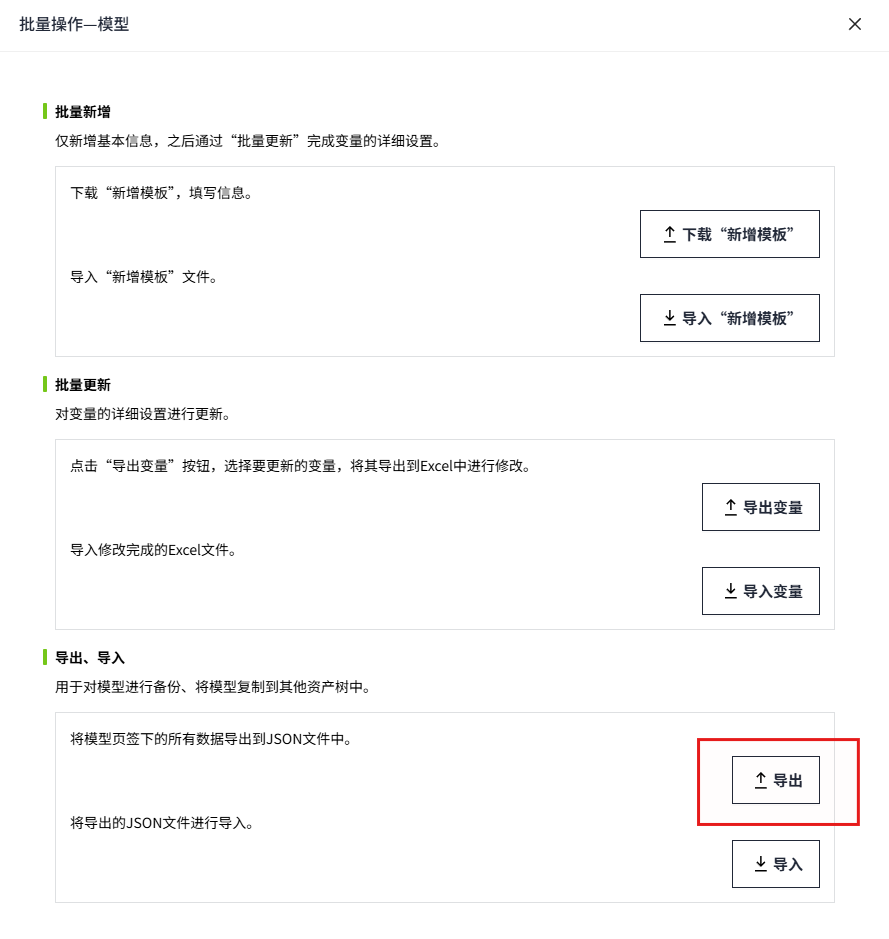
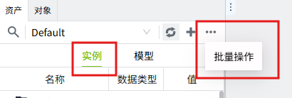
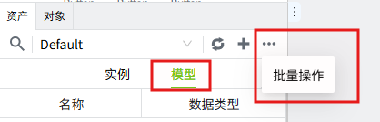
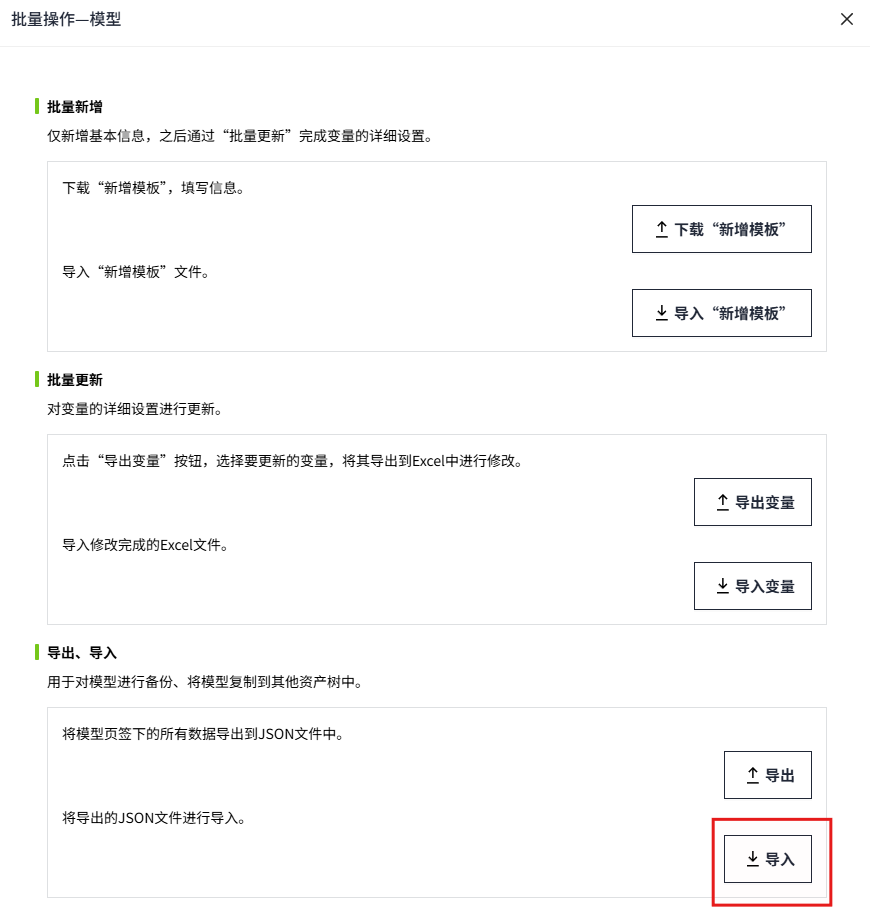

# 导出、导入

用于对模型或实例进行备份，将模型或实例复制到其他资产树中。

###### 导出

导出是将模型或实例页签下的所有数据导出到JSON文件中。

**导出模型**

在模型页签下，点击导出按钮后，将当前资产中的模型导出为*Json*文件。

**导出实例**

在实例页签下，点击导出按钮后，将当前资产中的实例导出为*Json*文件。

###### 导入

将导出的JSON文件进行导入。

**导入模型**

在模型页签下，点击批量操作按钮。

在弹窗中点击“导入”按钮。

**导入实例**

在实例页签下，点击批量操作按钮。

在弹窗中点击“导入”按钮。

说明：

1. 导入的文件必须与当前选项卡匹配，否则会提示错误。

    

2. 在单独导入实例内容时，请确保导入的树中存在Json中实例对应的模型对象，否则会导入失败。