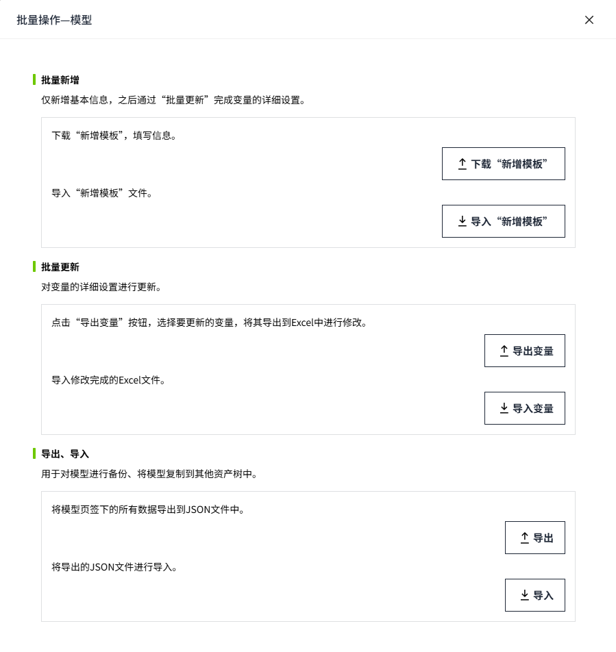

# 批量操作

当需要对多个变量进行相同或类似的操作时，尤其是在处理大量数据或进行系统配置时，通过批量操作能够显著提高效率, 同时降低手动操作中可能出现的错误。

**使用场景举例：**

- 批量新增变量: 当需要一次性创建多个变量时，批量操作可以简化流程。例如，在新增设备时，可能需要为每个设备创建一组相似的变量。
- 批量绑定数据源：当多个变量需要绑定到相同的数据源或不同但相似的路径时，批量操作可以快速完成这些设置。
- 批量更新变量属性：当多个变量的属性需要统一修改时，例如修改变量的变量组、报警设置等，使用批量操作可以避免逐个修改的繁琐操作。
- 批量导入/导出变量：在系统迁移、备份或初始化设置时，可能需要批量导入或导出变量的配置文件。

用户可在资产树编辑器内，点击更多按钮，可对模型和实例进行批量操作。

#### 批量操作模型

选中”模型“选项卡，点击**批量操作**按钮，对模型进行批量操作。支持导出、导入，批量新增和批量更新。

批量操作弹窗：

#### 实例

选中”实例“选项卡，点击批量操作按钮，对实例进行批量操作。支持导出、导入，批量新增和批量更新。

#### 功能描述

###### 批量新增

仅新增基本信息，之后通过“批量更新”完成变量的详细设置。

[批量新增](batch-add.md) 

###### 批量更新

对变量的详细设置进行更新。

[批量更新](batch-update.md) 

###### 导出、导入

用于对模型和实例进行备份、将实例复制到其他资产树中。

[导入、导出](export-and-import.md)