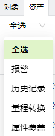
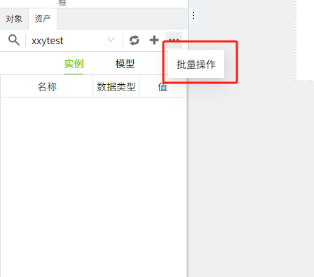
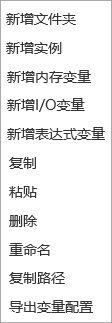
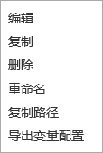
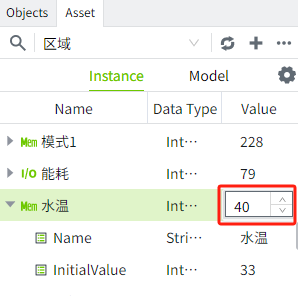
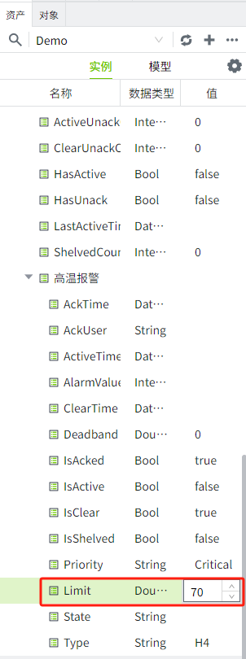
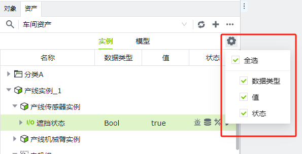

# 资产树

在编辑器内，点击**资产**窗口切换到资产树列表。所有的**变量**信息都在资产窗口中进行创建和维护。单击“展开”图标, 查看下级元素，单击“折叠”图标将该节点下的所有子元素折叠起来。

节点类型的图标说明：

| **图标**| **说明**   |
|:------------------------------------------------------------------------------------------------------------------------------------------------------------------------------------------------------------|:------------|
 | 文件夹     |
 | 模型       |
 | 实例       |
 | 集合       |
 | I/O变量    |
 | 内存变量   |
 | 表达式变量 |
 | 属性       |

#### 工具栏

| | 点击该图标后，顶部工具栏会转换为查询框。     在查询框内输入搜索关键字后，下方列表会筛选出名称中包含此关键字的所有节点。  不同层级的节点都将平铺显示在列表中。    点击左侧”全选“后面的下拉按钮，显示筛选条件，可以按条件筛选。  |
|------------------------------------------------------------------------------------------------------------------------------------------------------------------------------------------------------------|-----------------------------------------------------------------------------------------------------------------------------------------------------------------------------------------------------------------------------------------------------------------------------------------------------------------------------------------------------------------------------------------------------------------------------------------------------------------------------------------------------------------------------------------------------------------------------------------------------------------------------------------------------------------------------------------------------------------------------------------------------------------------------------------------------------------------------------------------------------------------------------------------------------------------------------------------------------------------------------------------------------------------------------------------------------|
|  | 通过资产下拉框，可以任意切换当前工程中的资产 |
|  | 刷新按钮，点击后，重新加载左侧资产选择框中的列表，以及下方资产树列表中的数据。 |
|  | 新增按钮，点击后会弹出新增菜单，在菜单中选择需要添加的内容。此处新增的数据将显示在**根节点**。  实例和模型选项卡，新增的类别不同。  | **实例选项卡：**   | **模型选项卡：**   | |-----------------------------------------------------------------------------------------------------------------------------------------------------------------------------------------------------------------------------|-----------------------------------------------------------------------------------------------------------------------------------------------------------------------------------------------------------------------------| |
|  | 点击后选择导出、导入操作。|
|  | 设置资产树中显示的列。  实例和模型选项卡，可显示的列不同。  | **实例选项卡：**   | **模型选项卡：**   | |-----------------------------------------------------------------------------------------------------------------------------------------------------------------------------------------------------------------------------|-----------------------------------------------------------------------------------------------------------------------------------------------------------------------------------------------------------------------------|                                                                      |

#### 批量操作

用户可点击编辑器右上角的更多按钮，选择批量操作。

#### 右键菜单

您可以右键单击资产树中的各个节点来执行各种操作。不同类型的节点将具有不同的右键菜单。

##### 模型选项卡

###### 文件夹右键菜单

-  新增文件夹：点击“新增文件夹“，弹出文件夹新增窗口。
-  新增模型：点击“新增模型“，弹出模型新增窗口。
-  复制：点击复制按钮，列表上方的粘贴按钮变为可点状态，所有文件夹的右键菜单中显示粘贴选项。可以将当前文件夹及其所有子节点内容粘贴到目标路径下。
-  粘贴：当对文件夹或者模型进行了复制操作后，文件夹右键菜单显示粘贴按钮。
-  删除：点击删除按钮，弹出删除确认窗口。在窗口中点击确定按钮将该节点及其子节点全部删除。
-  重命名：点击后当前节点变为编辑状态。重新命名后的文件夹不可以和当前层级下的其他节点重名。需要说明的是，文件夹重命名后，其下的子节点的路径都会随之改变。
-  复制路径：点击后复制当前节点的路径。复制后可以将该路径直接粘贴到文本输入框内。

###### 模型右键菜单

-  新增内存变量：点击后弹出新增内存变量窗口。
-  新增 I/O 变量：点击后弹出新增 I/O 变量窗口。
-  新增表达式变量：点击后弹出新增表达式变量窗口。
-  新增实例：点击后弹出新增实例窗口。
-  新增集合：点击后弹出新增集合窗口。
-  编辑：点击后弹出模型的编辑窗口。所有内容均支持修改。
-  复制：点击复制按钮，列表上方的粘贴按钮变为可点状态，所有文件夹的右键菜单中显示粘贴选项。模型复制后只可粘贴到文件夹下或者模型根节点下。
-  删除：点击删除按钮，弹出删除确认窗口。在窗口中点击确定按钮将该节点及其子节点全部删除。
-  重命名：点击后当前节点变为编辑状态，可以重新命名模型。重新命名后的模型不可以和当前层级下的其他节点重名。需要说明的是，重命名后，其下的子节点的路径都会随之改变。
-  复制路径：点击后复制当前节点的路径。复制后可以将该路径直接粘贴到文本输入框内。

###### 模型下变量的右键菜单

-  编辑：点击后弹出变量的编辑窗口。内容同新增窗口。在编辑窗口中，名称和数据类型不可修改，其他可修改。
-  删除：点击删除按钮，弹出删除确认窗口。在窗口中点击确定按钮将该变量删除。
-  重命名：点击后该节点变为编辑状态，可以重新命名变量。重新命名后的变量不可以和当前层级下的其他节点重名。需要说明的是，重命名后，变量的路径会随之改变。
-  复制路径：点击后复制当前节点的路径。复制后可以将该路径直接粘贴到文本输入框内。

######  模型下集合的右键菜单

-  删除：点击删除按钮，弹出删除确认窗口。在窗口中点击确定按钮将该节点删除。
-  重命名：点击后该节点变为编辑状态，可以重新命名集合。重新命名后的名称不可以和当前层级下的其他节点重名。需要说明的是，重命名后，集合的路径会随之改变。
-  复制路径：点击后复制当前节点的路径。复制后可以将该路径直接粘贴到文本输入框内。

######  模型下实例的右键菜单

-  编辑：点击后弹出变量的编辑窗口。内容同新增窗口。所有属性均可修改。模型变更后，自定义属性的内容会随之变更。
-  删除：点击删除按钮，弹出删除确认窗口。在窗口中点击确定按钮将该实例及其子节点全部删除。
-  重命名：点击后该节点变为编辑状态，可以重新命名实例。重新命名后的实例不可以和当前层级下的其他节点重名。需要说明的是，重命名后，实例的路径会随之改变。
-  复制路径：点击后复制当前节点的路径。复制后可以将该路径直接粘贴到文本输入框内。

######  实例下变量的右键菜单

-  编辑：点击后弹出变量的编辑窗口。内容同新增窗口。在编辑窗口中，名称和数据类型不可修改，其他可修改。
-  复制路径：点击后复制当前节点的路径。复制后可以将该路径直接粘贴到文本输入框内。

######  实例下集合的右键菜单

-  复制路径：点击后复制当前节点的路径。复制后可以将该路径直接粘贴到文本输入框内。

##### 实例选项卡

###### 文件夹右键菜单

-  新增文件夹：点击后弹出新增文件夹窗口。
-  新增实例：点击后弹出新增实例窗口。
-  新增内存变量：点击后弹出新增内存变量窗口。
-  新增 I/O 变量：点击后弹出新增 I/O 变量窗口。
-  新增表达式变量：点击后弹出新增表达式变量窗口。
-  复制：点击复制按钮，列表上方的粘贴按钮变为可点状态，所有文件夹的右键菜单中显示粘贴选项。可以将当前文件夹及其所有子节点内容粘贴到目标路径下。
-  粘贴：当对实例页签下的任意节点进行了复制操作后，文件夹右键菜单显示粘贴按钮。
-  删除：点击删除按钮，弹出删除确认窗口。在窗口中点击确定按钮将该节点及其子节点全部删除。
-  重命名：点击后节点变为编辑状态，可以重新命名文件夹。重新命名后的文件夹不可以和当前层级下的其他节点重名。需要说明的是，文件夹重命名后，其下的子节点的路径都会随之改变。
-  复制路径：点击后复制当前节点的路径。复制后可以将该路径直接粘贴到文本输入框内。
-  导出变量配置 ：点击后将当前节点下所有变量的配置信息进行导出。每个配置项分为一个 sheet 。例如基础属性一个 sheet,  事件一个 sheet 。对于报警，每种报警类型一个 sheet ，包括限值报警、等值报警、变化率报警、开关量报警。

######  实例右键菜单

-  编辑：点击后弹出变量的编辑窗口。内容同新增窗口。所有属性均可修改。模型变更后，自定义属性的内容会随之变更。
-  复制：点击复制按钮，列表上方的粘贴按钮变为可点状态，所有文件夹的右键菜单中显示粘贴选项。可以将当前文件夹及其所有子节点内容粘贴到目标路径下。
-  粘贴：当对实例页签下的任意节点进行了复制操作后，文件夹右键菜单显示粘贴按钮。
-  删除：点击删除按钮，弹出删除确认窗口。在窗口中点击确定按钮将该节点及其子节点全部删除。
-  重命名：点击后该节点变为编辑状态，可以重新命名实例。重新命名后的实例不可以和当前层级下的其他节点重名。需要说明的是，实例重命名后，其下的子节点的路径都会随之改变。
-  复制路径：点击后复制当前节点的路径。复制后可以将该路径直接粘贴到文本输入框内。
-  导出变量配置 ：点击后将当前节点下所有变量的配置信息进行导出。每个配置项分为一个 sheet 。例如基础属性一个 sheet,  事件一个 sheet 。对于报警，每种报警类型一个 sheet ，包括限值报警、等值报警、变化率报警、开关量报警。

######  非实例下变量的右键菜单

-  编辑：点击后弹出变量的编辑窗口。内容同新增窗口。在编辑窗口中，名称和数据类型不可修改，其他可修改。
-  复制：点击复制按钮，可以将当前变量粘贴到实例根节点或者文件夹下。粘贴后的变量名称不变。如果在当前层级存在同名文件，则粘贴后的新变量名称后缀自动加 1 。例如复制的变量名称为 A ，在当前需要粘贴的节点下，已经存在一个名称为 A 的节点，则粘贴后的变量名称显示为 A1 。
-  删除：点击删除按钮，弹出删除确认窗口。在窗口中点击确定按钮将该变量删除。
-  重命名：点击后该节点变为编辑状态，可以重命名。重新命名后的名称不可以和当前层级下的其他节点重名。
-  复制路径：点击后复制当前节点的路径。复制后可以将该路径直接粘贴到文本输入框内。
-  导出变量配置 ：点击后将当前节点下所有变量的配置信息进行导出。每个配置项分为一个 sheet 。例如基础属性一个 sheet,  事件一个 sheet 。对于报警，每种报警类型一个 sheet ，包括限值报警、等值报警、变化率报警、开关量报警。

######  实例下变量的右键菜单

-  编辑：点击后弹出变量的编辑窗口。内容同新增窗口。在编辑窗口中，名称和数据类型不可修改，其他可修改。
-  复制路径：点击后复制当前节点的路径。复制后可以将该路径直接粘贴到文本输入框内。
-  导出变量配置 ：点击后将当前节点下所有变量的配置信息进行导出。每个配置项分为一个 sheet 。例如基础属性一个 sheet,  事件一个 sheet 。对于报警，每种报警类型一个 sheet ，包括限值报警、等值报警、变化率报警、开关量报警。

######  实例下实例的右键菜单

-  编辑：点击后弹出实例的编辑窗口。内容同新增窗口。所有属性均可修改。模型变更后，自定义属性的内容会随之变更。
-  复制路径：点击后复制当前节点的路径。复制后可以将该路径直接粘贴到文本输入框内。
-  导出变量配置 ：点击后将当前节点下所有变量的配置信息进行导出。每个配置项分为一个sheet。例如基础属性一个sheet, 事件一个sheet。对于报警，每种报警类型一个sheet，包括限值报警、等值报警、变化率报警、开关量报警。

######  实例下集合的右键菜单

-  编辑：点击后弹出集合的编辑窗口。设置要生成的前缀名称以及数量。数量仅支持输入正整数。
-  复制路径：点击后复制当前节点的路径。复制后可以将该路径直接粘贴到文本输入框内。
-  导出变量配置 ：点击后将当前节点下所有变量的配置信息进行导出。每个配置项分为一个 sheet 。例如基础属性一个 sheet,  事件一个 sheet 。对于报警，每种报警类型一个 sheet ，包括限值报警、等值报警、变化率报警、开关量报警。

###### 集合 下实例的右键菜单

-  编辑：点击后弹出编辑窗口。
-  删除：点击删除按钮，弹出删除确认窗口。在窗口中点击确定按钮将该数据 删除。
-  复制路径：点击后复制当前节点的路径。复制后可以将该路径直接粘贴到文本输入框内。
-  导出变量配置 ：点击后将当前节点下所有变量的配置信息进行导出。每个配置项分为一个 sheet 。例如基础属性一个 sheet,  事件一个 sheet 。对于报警，每种报警类型一个 sheet ，包括限值报警、等值报警、变化率报警、开关量报警。

#### 快捷操作

######  双击节点进入编辑界面

 在资产树上双击变量、模型、实例节点，打开对应的编辑界面 。

######  双击改值

 在资产树上双击变量的值，值变为编辑状态，可以修改变量的值，输入值后按回车键或者点击输入框之外区域，完成值的保存。

只有开启了”可写“属性的变量才支持双击写值。

除了变量值支持双击修改，变量的报警信息中，**限值报警**的值和**等值报警**的值也支持双击修改。

###### 快捷键

 资产树支持以下快捷键操作：

-  Ctrl+c ：复制
-  Ctrl+v ：粘贴
-  Del ：删除
-  Enter ：输入查询内容后按 enter 键执行查询操作

######  多选删除

 支持按 Ctrl 键选择多个节点后一起删除。

 选择任意层级的节点一起删除。如果选择了父节点，则子节点会一起被删除。

 属性节点不支持单独选择后进行删除。

#### 变量标识

变量配置在资产树中可以直观地显出来示。

我们可以点击设置图标，勾选”状态”将状态列显示出来。

变量的状态列，将会直观的展示出变量部分配置的状态。深色图标代表已配置，浅色图标代表未配置。

状态图标描述如下：

| **图标**                                                                                                                                                                                                   | **说明**                                      |
|------------------------------------------------------------------------------------------------------------------------------------------------------------------------------------------------------------|-----------------------------------------------|
|  | 当变量开启了报警配置时，显示此图标             |
|  | 当变量开启了历史存储时，显示此图标             |
|  | 当变量开启了量程转换时，显示此图标             |
|  | 当该变量配置存在任意一个重写配置时，显示此图标 |

