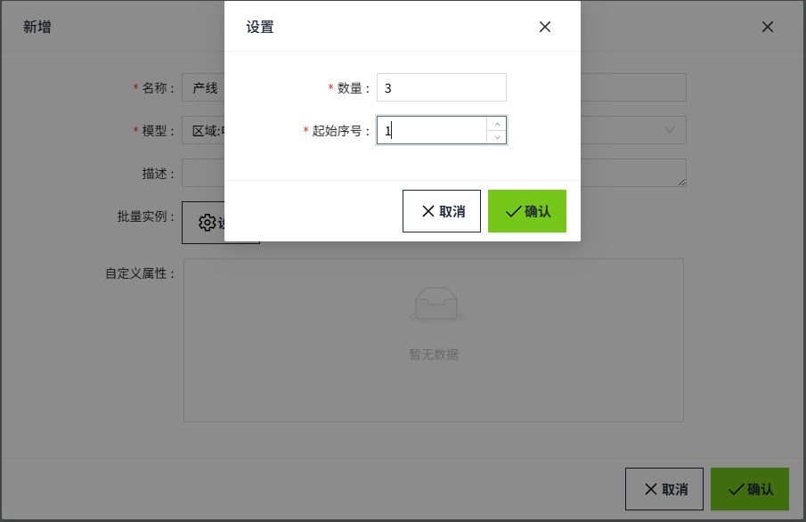
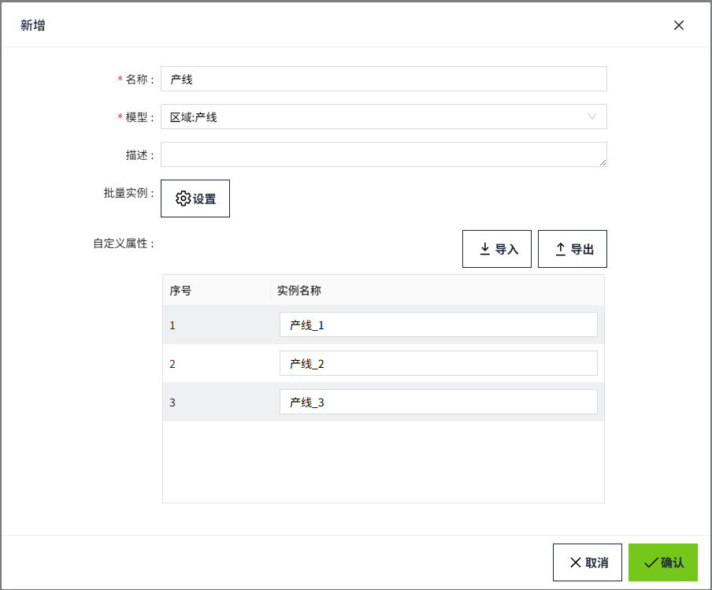
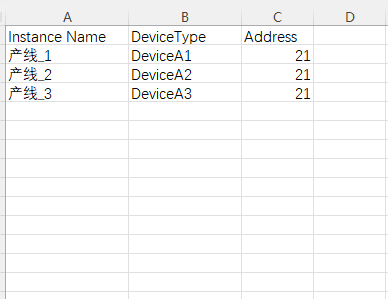

# 批量实例化模型

可以通过以下方式批量实例化模型。

1. 在”实例“标签中，点击新增按钮，选择”实例“。

2. 在”实例“标签中，在文件夹的右键菜单中选择”新增实例“。

3. 在”模型“标签中，在模型的右键菜单中选择”新增实例“。

在通过界面新增实例的时候，可以通过点击弹窗上的“生成”按钮一次性生成多个实例，也可以通过导入Excel文件一次性生成多个实例。

#### 通过页面修改实例属性

点击批量实例中的“生成”按钮，输入需要生成的实例数量和起始序号，生成多条实例。

在自定义列表中，显示生成的实例，以及每个实例对应的自定义属性。可以按照需要修改单元格内容。

当实例数量较多或者自定义属性较多时，在页面上进行操作可能会存在诸多不便，所以我们还提供了导出导入功能，您可以将数据导出，在excel中编辑好数据之后再将其导入。

#### 通过导出文件修改实例属性

##### 导出

生成了实例后，点击导出按钮，将实例导出。

导出成功后，在Excel按照导出的格式进行编辑。每一行为一个实例。第一列为实例名称，其余列是所选模型的自定义参数。

| **说明：**  1. 在excel中自行创建的列，导入后，不会显示在自定义属性列表中。 2. 在excel中删除了某列自定义属性，导入后，在自定义属性列表中，该列的对应值为空。 |
|-----------------------------------------------------------------------------------------------------------------------------------------------------|

##### 导入

文件修改完成后，点击导入按钮将文件导入。

导入完成，点击“确认”按钮，在资产树上生成多个实例。

