# 引用与重写

#### 引用

引用在**WAGO VC Hub**系统中泛指**模型**与**实例**间的关系，实例泛指**模型实例**和**实例**。

引用可以发生在**多层级**中，因此两个**实例**之间也可能存在引用关系。

下面我们用一个示例来说明它们之间的关系。

假设：

- 模型模块下存在1个”电机“模型，”电机“下有一个”瞬时功率“变量；
- 模型模块下存在1个”产线“模型，”产线“下有一个”电机“模型的模型实例”电机实例“；
- 实例模块下存在1个”产线“模型的实例，命名为”产线实例“。

各对象关系如下图所示：

###### 电机

”电机“模型下存在子集”瞬时功率“变量，整个”电机“都是独立存在的，它不依赖于任何对象。

###### 产线与电机

”产线“模型下存在子集”电机实例“实例，因为”电机实例“引用自”电机“模型，所以”电机实例“下同样也会存在”电机”模型下的“瞬时功率”变量，“产线”模型下的“瞬时功率”变量与“电机”模型下的“瞬时功率”变量存在引用关系。

“电机实例”引用自“电机”模型。

“电机实例”下的“瞬时功率”变量引用自“电机”模型下的瞬时功率对象。

###### 产线实例与产线

”产线实例“实例引用自”产线“模型，”产线实例“下会存在”电机实例“，且会将“电机实例”下的“瞬时功率”变量引用过来。

”产线实例“引用自“产线”模型。

“产线实例”下的“电机实例”引用自“产线”下的“电机实例”。

“产线实例”下的“电机实例”下的“瞬时功率”变量引用自引用自“产线”下的“电机实例”下的“瞬时功率”变量。

###### 引用对象之间的影响

两者存在引用关系的情况下，除了引用对象会把被引用对象下的子集对象带过来以外，同样的，当被引用对象对自己的子集进行新增和删除操作，都会作用到引用对象，例如：

- 当在“电机”模型下，添加一个名为“开关状态”的变量时，“产线”模型下“电机实例”中都会自动添加一个“开关状态”的变量，又因为“产线实例”下“电机实例”引用自“产线”模型下“电机实例”，所以“产线实例”下“电机实例”中也会添加一个“开关状态”的变量。
- 当删除“电机”模型下的“瞬时功率”时，“产线”模型下“电机实例”中也会将“瞬时功率”变量删除，与此同时，连带着“产线实例”下的“瞬时功率”也会被删除。

“产线”模型中，“电机实例”是引用自“电机”模型创建的，我们无法对“电机实例”的所有子集进行新增、删除操作，同样，“产线实例”时引用自“产线”模型创建的，我们也无法对“产线实例”的子集做任何新增、删除操作。这种情况下，我们要修改一个实例下的节点，必须要在其根引用模型下进行操作，例如我们想在“产线实例”下“电机实例”中添加一个“日耗能”的变量，那么我只需要在“电机”模型下添加即可，程序会自动同步引用数据。

#### 重写

上述中，介绍了引用的定义，而重写的概念就发生在引用与被引用的节点之间。

如图所示，“产线实例”下的“瞬时功率”引用自“产线”模型下的“瞬时功率”，“产线”模型下的“瞬时功率”引用自“电机”模型下的瞬时功率，总体上，实现了一个2层的引用关系。

我们下面以“瞬时功率Out”、“瞬时功率Middle”，“瞬时功率In”来代指它们（这里的代指没有任何意义，仅为了方便讲解）。

假设我们在创建“瞬时功率In”时，配置的初始值是50，配置的单位是“W”，那么我们在初始化“瞬时功率Out”、“瞬时功率Middle”时，它们的初始值也会是50，配置的单位也会是“W”，以此为前提的情况下：

1. 这时我们修改“瞬时功率In”的初始值为100，因为“瞬时功率Middle”引用自“瞬时功率In”，那么“瞬时功率Middle”的初始值会被同步为100，又因为“瞬时功率Out”引用自“瞬时功率Middle”，那么“瞬时功率Middle”的初始值也会被同步为100；
2. 我们修改“瞬时功率Middle”的初始值为80，又因为“瞬时功率Out”引用自“瞬时功率Middle”，那么“瞬时功率Middle”的初始值也会被同步为80，“瞬时功率Middle”的初始值就处于重写状态，此时如果再对“瞬时功率In”的值进行修改，将不会同步到“瞬时功率Middle”上，也不会传递同步到“瞬时功率Out”上，但此时修改“瞬时功率In”的单位的话，同步仍然会被进行；
3. 我们再修改“瞬时功率Out”的初始值为200后，那么它的初始值就会处于重写状态，无论对“瞬时功率Middle”和“瞬时功率In”的初始值如何更新，都不会影响到“瞬时功率Out”的初始值。

总结而言，重写只存在于引用和被引用之间，当对引用对象中的配置修改后，被引用对象修改该配置，就不会同步到引用对象，反之，当配置引用对象中的配置为被特殊修改，那么被引用对象修改的配置将会同步到引用对象中。

###### 如何解除重写

当引用对象重写后，输入框右侧会显示“绿点”标识，如下图中初始值所示。

用户如需解除重写，直接点击“绿点”将其置为灰色即可，初始值则会重置为被引用对象中的初始值，下图中被引用对象中的初始值为0，那么则被重置为0。

有一种特殊情况，“瞬时功率Out”的初始值继承自“瞬时功率Middle”的初始值100，我们想要将“瞬时功率Out”的初始值重写为100，解除它们之间的继承关系该如何做？

这时，我们直接修改“瞬时功率Out”的初始值为100是无效的，配置弹窗中的重写标识——“配置项右侧灰点”提供了主动重写状态变更功能，用户可以直接点击“灰点”，将其置为绿色即可。

