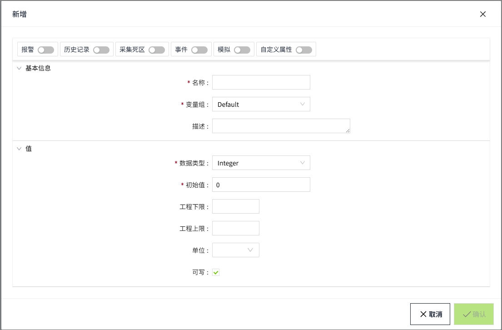
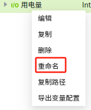

# 创建变量

变量只能在资产窗口中进行创建。

您可以通过两种不同的方式创建变量：

- 在资产树顶部的菜单中，单击“添加”图标，在展开的菜单中选择要创建的变量类型。此处添加的内容会显示在根节点，例如下图的“温度”。

- 在资产树窗口中，在**实例页签下的目录**或者**模型页签下的模型**上右击鼠标，在弹出的菜单中选择要创建的变量类型。新增的变量会显示在对应的目录或者模型下，作为其子节点。

|  |  |
|------------------------------------------------------------------------------------------------------------------------------------------------------------------------------------------------------------|------------------------------------------------------------------------------------------------------------------------------------------------------------------------------------------------------------|

#### 新增变量

1. 选择要新增的变量，例如内存变量，会打开如下新增弹窗。新增页面，默认只显示“**基本信息**”和“**值**”这两个配置信息，其他配置均处于未启用状态，在弹窗顶部 开启对应的配置后，才会在下图的新增界面上显示对应的配置项信息。

    

2. 设置各配置项，设置完成点击右下角的“确认”按钮，该变量将显示在资产窗口。

**说明**：如果配置了某个配置项（例如：历史存储） 后又将其关闭 并保存了变量， 则下次在该变量上再次启用该配置时，会 自动显示上次已 配置的内容。 

#### 编辑变量

1. 您可以在变量上右击鼠标，在弹出的菜单中点击”编辑“按钮进行编辑，也可以双击变量打开编辑窗口，进行编辑。

    

    

    **名称**和**数据类型默认情况下**不支持修改。点击名称后面的编辑按钮后，名称变为可编辑状态。

    !

2. 编辑完成点击右下角的“确认”按钮，完成编辑。

#### 重命名变量

1. 要重命名变量，请右键单击变量，然后选择**重命名**选项；也可以慢双击该变量，使其进入重命名状态。

    

2. 光标现在将在变量名称内闪烁，您可以键入新名称。

    

#### 复制、粘贴变量

1. 要复制变量，请右键单击标签，然后选择**复制**选项。

    

2. 复制后的变量可以进行粘贴。

    在实例页签下复制的变量，只能粘贴到实例页签的目录下；在模型页签下复制的变量，只能粘贴到模型下。

    在对应的文件上右击选择粘贴即可。

    