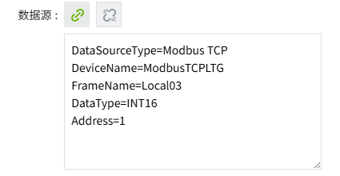
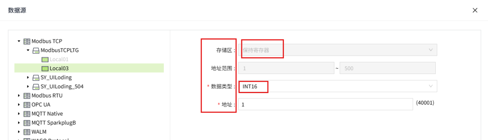
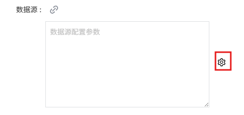
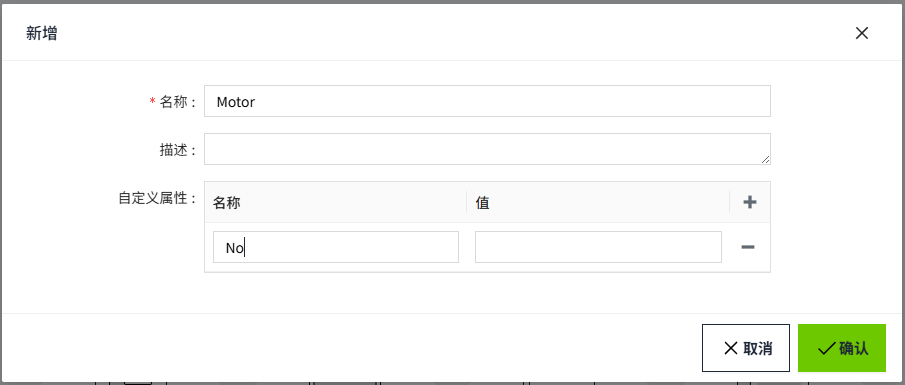
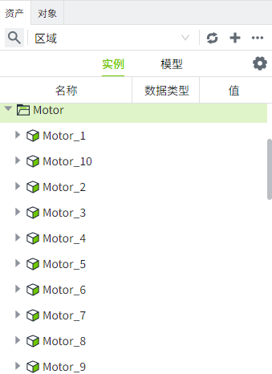

# I/O变量绑定数据源

I/O变量可以绑定数据源，可以直接绑定一个固定的数据源路径，也可以使用参数化的方式绑定一个动态路径。

#### 直接绑定

在I/O变量的新增和修改界面，点击数据源的绑定按钮, 弹出数据源绑定弹窗。

在弹窗中，选择一个设备，配置参数后，点击确认按钮，完成绑定。例如下图所示。

完成绑定后，在变量的新增和编辑窗口，可以看到具体的数据源路径信息，如下图红框所示：

**说明**：  
    1. 绑定到不同的数据源，会显示不同的数据源路径参数。  2. 数据源文本框中，=左侧表示参数名，=右侧表示参数值。可以修改参数值，不建议修改参数名，修改参数名将导致绑定路径失效。  3. 请确保数据源输入框中，=左右两侧的内容，与配置页面字段的大小写需一致，否则可能导致数据源绑定失败。建议不要修改=左侧的参数名。  示例如下：  数据源参数字段：    配置页面字段：   

###### 数据源绑定路径参数

| **数据源类型**      | **参数** |
|:---------------------|:--------------------------------------------------------------------------------------------------------------|
| **OPC UA**          | - DataSourceType - Path - NodeId - DisplayName - DeviceName - GroupName - DataType - IndexOfArrayStr         |
| **Modbus TCP**      | - DataSourceType - DeviceName - FrameName - DataType - Address - Bit (Only Bool tag displays this parameter) |
| **Modbus RTU**      | - DataSourceType - DeviceName - FrameName - DataType - Address - Bit (Only Bool tag displays this parameter) |
| **MQTT Native**     | - DataSourceType - Tag - Address - DataType - DeviceName - GroupName - NodeName                              |
| **MQTT SparkplugB** | - DataSourceType - Tag - Address - DataType - DeviceName - GroupName - NodeName                              |
| **SIEMENS S7**      | - DataSourceType - DeviceName - Area - DbNumber - DataType - BitOffset - CharLength - AddressOffset          |
| **WAGO Protocol**   | - DataSourceType - Path - Tag - DataType - DeviceName                                                        |

#### 参数化绑定

在**模型**或者**实例**下创建的I/O变量才支持参数化绑定。在数据源文本框后面会显示设置按钮，从设置弹窗中选择需要替换的参数。

###### 示例：

**工厂有 10个电机，电机下具有相同的变量，唯一的区别是电机连接到不同的数据源。我们希望电机1连接到Device1, 电机2连接到Device2,...电机10连接到Device10。**

**批量创建设备请参考如下章节。**

- [批量操作Modbus TCP设备](../../../devices/modbus-tcp/batch-operation.md) 
- [批量操作Modbus RTU设备](../../../devices/modbus-rtu/batch-operation.md) 
- [批量操作OPC UA设备](../../../devices/opc-ua/batch-operation.md)
- [批量操作MQTT Native设备](../../../devices/mqtt-native/batch-operation.md) 
- [批量操作MQTT SparkplugB设备](../../../devices/mqtt-sparkplugb/batch-operation.md)
- [批量操作SIEMENS S7设备](../../../devices/siemens-s7/batch-operation.md) 
- [批量操作WAGO Protocol设备](../../../devices/wago-protocol/batch-operation.md) 

1. 在”设备”->Modbus TCP列表中批量创建10个modbus tcp设备，名称为Device1~Device10。只有DeviceName和Host不同，其他配置相同。
2. 在”模型“页签下，新建一个模型”Motor“，该模型包含1个自定义参数”No“,表示电机编号。

    

3. 鼠标右击该模型，创建I/O变量 ”功率“。

    

4. 为变量绑定一个数据源后点击数据源参数的设置按钮，显示变量所属模型”电机“的自定义参数列表。

    

可以将参数值替换为模型的自定义属性，模型的自定义属性通过 {} 引用。在创建实例时使用自定义参数值替换路径中的参数。

    

5. 变量创建完成后。切换到”实例“页签，创建一个名为Motor的文件夹，在文件夹下使用模型“Motor”添加实例。

    

6. 在添加实例窗口，模型选择**Motor,** 点击“批量实例”的设置按钮，”数量”设置10，”起始序号“设置为1。

    

7. 接着我们为每个实例设置自定义参数No。我们将Motor_1绑定到Device1上，所有Motor_1的No值设置为1，依次类推。

    

8. 设置完成，点击“确认”按钮，会在Motor目录下，生成10个实例。实例下包含相同的变量：功率。

    

9. 可以通过文本控件，将文本内容绑定到变量的DataSource属性上，查看路径。

    

10. 最终实现了变量的批量绑定。**电机1的所有变量绑定到Device1, 电机2的所有变量绑定到Device2,...电机10的所有变量绑定到Device10。**

