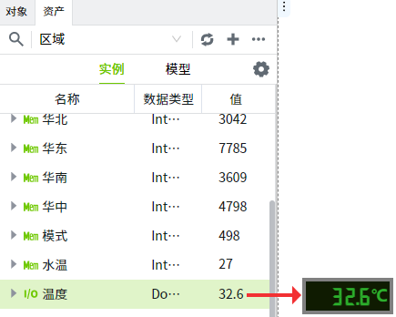

# 变量

WAGO VC Hub中，变量指的是监控和控制过程中的可测量、可操作的数据或状态。这些变量可以是各种类型的信息，如温度、压力、流量、电流、电压、开关状态等，用于反映监测对象的实时状态或性能。

在WAGO VC Hub系统中，变量是系统中的基本组成单元，其值可以通过传感器、仪表或其他数据源采集得到。这些变量的实时数据通过VC Hub系统收集、存储、显示和分析，使运营人员能够有效地监视和控制监测对象。

在设计器的资产窗口中，可以创建变量。每个变量都有许多属性，如报警、历史记录等。创建变量后，可以在控件、脚本或报表中使用它们。

下面是一个控件绑定变量的简单例子。数码管上绑定了变量“温度”，在数码管上可以实时显示温度的值。

## 变量特性

变量在WAGO VC Hub中具有以下功能：

- 面向对象设计。通过对模型进行实例化，可以批量创建变量，节省时间。
- 强大的报警模型。每个变量上都可以配置任意数量的报警 。支持多种报警类型，包括限值报警、变化率报警、等值报警、开关量跳变报警。
- 历史记录。历史记录模块使存储和使用历史数据变得容易。只需开启变量的历史记录，历史数据将以有效的格式存储在数据库中。然后，可以通过脚本、历史趋势图、历史检索控件、报表等进行数据查询和显示。

## 变量命名

-  名称在同一层级内需唯一。
-  名称只能包含英文字母、中文、数字和下划线，且仅以英文字母或中文开头。
-  大小写敏感，这意味着`Temperature`和`temperature`被视为两个不同的变量。
-  长度不得超过20个字符。

为了增加可维护性和可读性，建议使用描述性的、有意义的变量名。这有助于其他人更容易理解变量的用途和含义。
