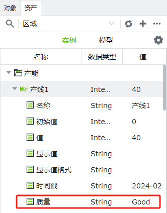
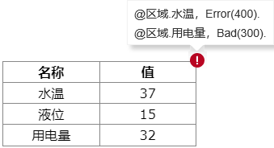

# 质量位

质量位作为变量的一个属性，用于表示对变量值的置信度。通过质量位代码来反映变量的质量。

质量位代码由级别（“Good”、“Uncertain”、“Bad”、“Error”）和整数组成。如果一个值的质量不好，则通常不应信任该值 。

您可以在资产窗口中，找到您想查看的变量，将其展开，查看其质量。下图显示了一个质量位是Good的变量，这意味着变量当前值是可信的。

### 质量位代码 

目前系统中设定4 个级别的质量位，分别是Good 、Bad 、Uncertain 和Error ，每一个级别都包含 一系列的子代码，这些子代码将提供当前变量的更具体的质量 信息。

系统对每个级别的质量位划分了不同代码区域，如下所示：

1. **Good** **：** **100~199** 。质量好，通常被认为时可靠的可信任的值。
2. **Uncertain** **：** **200~299** 。质量不确定，通常代表一个好值，但由于未收到新值而可靠性不能确定。
3. **Bad** **：** **300~399** 。质量差，值存在问题，但它是“预期”或公认的问题类型。例如，试用已过期或读取访问权限被明确拒绝。
4. **Error** **：** **400~499** 。错误质量，完全出乎意料的问题。例如， 变量配置错误、类型错误等。

**说明**：需要注意的是，并非范围内的每个值都有代码 ，空余的值用于未来扩展和添加新的代码。 

| **Good**                          | **Code** **(** **100~199** **）** | **说明**| **示例**|
|:------------------------------------|:----------------------------------|:--------------------------------------------------------------------------------|:-----------------------------------------------------------------------------|
| Good                               | 100                              | 一个通用的、符合被认为可靠标准的。                                               | 正常采集到的，质量位是好的值                                                 |
| Good_Initial                       | 101                              | 一个可被认为可靠的变量初始值。                                                  | 变量创建后第一次推送的初始值                                                |
| **Uncertain**                      | **Code(200~299)**                | **说明**| **示例**|
| Uncertain                          | 200                              | 一个通用的、存在未指明的不确定性的值。目前仅适配OPC UA 驱动。                     | 当前 质量位代码对应OPC UA协议中的代码64 ，65 ，66，67                          |
| Uncertain_LastUsableValue          | 201                              | 此变量的值对方已经停止更新，当前值应该被视为已经过时。目前仅适配OPC UA 驱动。     | 当前 质量位代码对应OPC UA协议中的代码68 ，69 ，70 ，71                         |
| Uncertain_DataSubNormal            | 205                              | 该值需要多个源数据才能生成，并且其良好源数少于所需的数量。目前仅适配OPC UA 驱动。 | 当前 质量位代码对应OPC UA协议中的代码88 ，89 ，90 ，91                         |
| Uncertain_EngineeringUnitsExceeded | 206                              | 值已超出其配置的工程单 位。 目前仅适配OPC UA 驱动。                              | 当前 质量位代码对应OPC UA协议中的代码84 ，85 ，86 ，87                         |
| **Bad**                           | **Code(300~399)**                | **说明**                                                                       | **示例**                                                                    |
| Bad                                | 300                              | 一个通用的、错误值的常规代码。目前仅适配OPC UA 驱动。                             | 当前 质量位代码对应OPC UA协议中的代码0 ，1 ，2 ，3 。                           |
| Bad_NotFound                       | 310                              | 请求的对象不存在。                                                              | 变量已被删除，此时尝试去 订阅该 变量的值。                                    |
| Bad_NotSupported                   | 311                              | 设备中的点位不支持绑定。                                                        | OPC Server中的节点不支持绑定和访问。                                         |
| Bad_NotConnected                   | 315                              | 当前变量所需的驱动未连接或连接已关闭。                                          | 驱动未成功与设备连接或连接时发生错误；  驱动被手动停止；  驱动处于未启动状态。 |
| Bad_OutofRange                     | 320                              | 当前变量的值超出工程上下限。                                                    | 如果一个变量配置了工程上限或者下限，变量值超出上限或者下限范围时。            |
| **Error**                          | **Code(400~499)**                | **说明**                                                                       | **示例**                                                                    |
| Error                              | 400                              | 一个通用的、指示当前变量存在错误的代码。                                         | 错误不能使用其他Error 代码来说明时，则统一使用当前code 表示。                 |
| Error_Configuration                | 401                              | 当前变量的配置存在错误。                                                        | 变量绑定的设备不存在。                                                       |
| Error_Expression                   | 402                              | 生成此变量值的表达式执行错误。                                                  | 表达式变量的表达式解析执行时发生任何错误 。                                  |
| Error_TypeConversion               | 405                              | 接收到的值无法强制转换到变量设置 的数据类型。                                   | 表达式数据类型转换失败；  采集到的值类型与变量类型不一致且强转失败 。         |
| Error_Exception                    | 410                              | 变量获取值的过程中捕获到的异常。                                                | 驱动采集时发生的任何错误 。                                                  |
| Error_InvalidPath                  | 411                              | 变量的路径或者路径语法错误。                                                    | 表达式依赖的变量路径不合法(不满足命名规则) 。                                |

### 控件显示质量位角标

如果控件上绑定了变量，则可以通过角标来呈现所绑定的值的质量位。仅质量为Bad 、Uncertain 和Error时才显示角标。

| **角标**| **质量**  |
|:------------------------------------------------------------------------------------------------------------------------------------------------------------------------------------------------------------|:-----------|
|  | Uncertain |
|  | Bad       |
|  | Error     |

如果控件绑定了多个变量，并且这些变量存在多种质量的情况下，在控件的右上角仅显示质量级别最高的角标，将鼠标悬浮到角标上，可以显示完整的提示信息。如下图所示。

级别：Error>Bad>Uncertain

