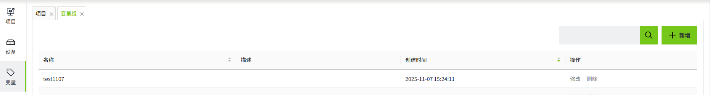
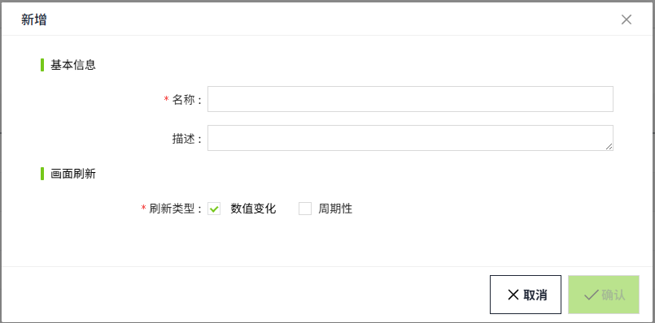

# 变量组

变量组的主要作用是对变量进行分组，组内的变量按照统一的刷新频率推送到实时画面。变量组的主要作用是为了提升系统的实时组态画面刷新性能，根据实际需求，降低客户端变量值的处理频率，防止在客户端性能不佳的情况下，频繁的和服务器交互，导致画面崩溃。

WAGO VC Hub中，会默认创建一个名为“Default”的变量组，该变量组默认配置为数值变化和周期性推送同时开启，周期性频率设置为500ms。

在创建变量的时候需要为变量选择已经创建的变量组。

### 刷新类型

支持数值变化和周期性两种刷新类型。

#### 数值变化

变量的值发生变化时，就会将变量值推送到画面。

#### 周期性

按照设置的周期，将变量值定时推送到画面。

### 如何使用

在”变量“->”变量组“页面，管理变量组。内置的变量组不支持删除。

### 查询

变量组默认以**创建时间**倒序排列，用户可以根据需要，自定义排序。

用户可以通过右上角输入框，对变量组名称进行模糊查询。

### 新增

用户点击右上角”新增”按钮，在弹窗中填入变量组信息后，可以新增变量组。

| **配置** | **描述**|
|:----------|:-----------------------------------------------------------------------|
| 名称     | 变量组的名称，名称不可重复，必填项。变量在绑定变量组时，以该名称进行关联。 |
| 描述     | 变量组描述信息，可选填。|
| 刷新类型 | 控制变量如何推送到画面，分为数值变化和周期性。|

### 修改

点击变量组列表任意数据的“修改“按钮，可以修改变量组的信息。在变量组的修改弹窗中会显示使用了该变量组的所有变量路径。

注意：修改变量组名称后，已使用了该变量组的变量，其变量组信息会丢失，请谨慎修改变量组名称。

### 删除

点击变量组的删除按钮，对变量组进行删除。注意，当变量组被删除后，绑定该变量组的变量，其变量组信息会丢失，请谨慎删除。