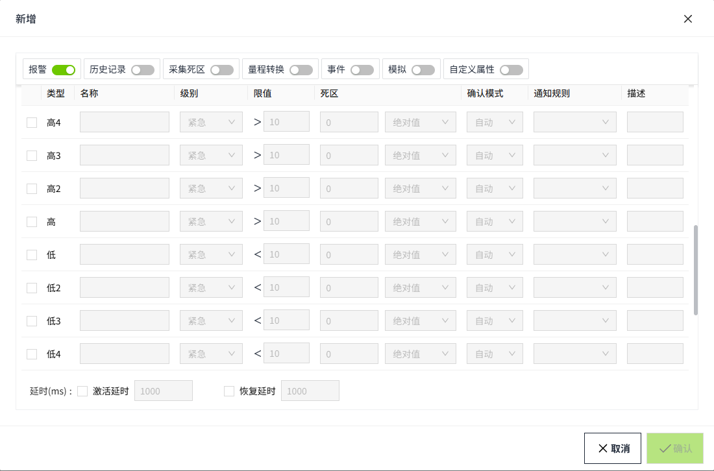

# 报警

报警用于提醒和警示系统运行状态异常或超出预设范围。

WAGO VC Hub 包含4种报警类别：

-  限值报警：如果变量值超过或低于 配置中指定的值，则触发报警。
-  等值报警：如果变量值等于配置中指定的值，则触发报警。
-  变化率报警：在变化周期内，如果变量的值的变化率大于或等于配置中指定的值，则触发报警。
-  开关量报警：当布尔值 发生变化时，则触发报警。

 不同的数据类型可以设置不同类别的报警。

| **数据类型** | **限值报警** | **等值报警** | **变化率报警** | **开关量报警** |
|--------------|--------------|--------------|----------------|----------------|
| I nteger     | √            | √            | √              | X              |
| Double       | √            | √            | √              | X              |
| B ool        | X            | X            | X              | √              |
| S tring      | X            | √            | X              | X              |
| D ateTime    | X            | X            | X              | X              |

#### 如何启用

在变量的编辑弹窗中，顶部有**报警**的开关，开启后设置报警。

###### 限值报警

 支持 8 限报警。高 4 、高 3 、高 2 、高、低、低 2 、低 3 、低 4 。默认所有类型处于未勾选状态。勾选某一行后，该行处于可编辑状态。可以选择多个类型。

| **属性**     | **描述** |
|:--------------|:-----------------------------------------------------------------------------------------------------------------------------------------------------------------------------------------------------------------------------------------------------------|
| 名称         | 必填，设置该条 报警的名称。|
| 级别         | 报警的级别。 包含4种级别：紧急、高级、中级、低级。|
| 限值         | 预设的一个值。当变量值高于或低于该值时，发生报警。|
| 死区         | 预设的一个值。当设备或系统出现异常情况时，为避免频繁地发送报警信息而设置的一个范围。在这个范围内，即使变量值超出了预设的上限或下限，系统也不会立即触发报警，而是等待超过死区后再进行报警。                                                                       |
| 确认模式     | 设置报警的确认模式 。包含 ：自动、手动（需确认）、手动（无需确认）。   选择自动，当报警恢复时，系统自动进行确认；   选择手动（需确认），不论报警恢复与否，都需要手动进行确认，并填写确认信息 ；   选择手动（无需确认），不论报警恢复与否，都需要手动进行确认，无需填写确认信息 。 |
| 通知规则     | 非必填。选择在“报警”->"报警通知"->“通知规则”列表中的数据。选择通知规则后，该条报警发生时，按照所选的通知规则给对应用户发送报警通知。|
| 描述         | 非必填。对报警的描述。|
| 区间包含模式 | 包含开和闭，默认选择闭。当选择闭时，在限值前面显示 >= ；当选择开时，在限值前面显示 > 。|
| 激活延时     | 默认不勾选。用于设置等待多久后才判断当前值是否处于报警状态。单位ms。|
| 恢复延时     | 默认不勾选。用于设置等待多久后才判断当前值是否处于恢复状态。单位ms。|

**说明**：每个限值的报警单独判断。例如：一个变量值，既 大于了高的限值，也大于高1的限值，则在报警控件中该变量在同一时刻 会显示2条报警，一条类型为高，一条类型为高1。 

###### 等值报警

 点击添加按钮进行添加数据。可以添加多行。添加后需 勾选该条配置 ，该配置才生效，点击删除按钮，删除该配置。

| **属性** | **描述** |
|:----------|:-----------------------------------------------------------------------------------------------------------------------------------------------------------------------------------------------------------------------------------------------------------|
| 名称     | 必填，设置该条 报警的名称。|
| 级别     | 报警的级别。 包含4种级别：紧急、高级、中级、低级。|
| 值       | 当变量值等于该值时，触发报警。|
| 确认模式 | 设置报警的确认模式 。包含 ：自动、手动（需确认）、手动（无需确认）。   选择自动，当报警恢复时，系统自动进行确认；   选择手动（需确认），不论报警恢复与否，都需要手动进行确认，并填写确认信息 ；   选择手动（无需确认），不论报警恢复与否，都需要手动进行确认，无需填写确认信息 。 |
| 通知规则 | 非必填。选择在“报警”->"报警通知"->“通知规则”列表中的数据。选择通知规则后，该条报警发生时，按照所选的通知规则给对应用户发送报警通知。|
| 描述     | 非必填。对报警的描述。|
| 激活延时 | 默认不勾选。用于设置等待多久后才判断当前值是否处于报警状态。单位ms。|
| 恢复延时 | 默认不勾选。用于设置等待多久后才判断当前值是否处于恢复状态。单位ms。|

###### 变化率报警

 点击添加按钮进行添加数据。可以添加多行。添加后需 勾选该条配置 ，该配置才生效，点击删除按钮，删除该配置。

| **属性** | **描述** |
|:----------|:-----------------------------------------------------------------------------------------------------------------------------------------------------------------------------------------------------------------------------------------------------------------------------------------------------------------------------------------------------------|
| 名称     | 必填，设置该条 报警的名称。|
| 级别     | 报警的级别。 包含4种级别：紧急、高级、中级、低级。|
| 变化率   | 当变量值的变化率大于等于 设置的变化率时，产生报警。   变化率报警的**计算公式** 如下：  **((变量的当前值－变量上一次变化的值)×100×(周期值))/((变量本次变化的时间－变量上一次变化的时间)×(变量的最大值－变量的最小值))**   如果周期为秒，则该值为填写的周期值；如果周期为分，则该值为填写的周期值 *60 ；  ( 变量本次变化的时间－变量上一次变化的时间 ) 的结果单位为秒。 |
| 确认模式 | 设置报警的确认模式 。包含 ：自动、手动（需确认）、手动（无需确认）。   选择自动，当报警恢复时，系统自动进行确认；   选择手动（需确认），不论报警恢复与否，都需要手动进行确认，并填写确认信息 ；   选择手动（无需确认），不论报警恢复与否，都需要手动进行确认，无需填写确认信息 。|
| 通知规则 | 非必填。选择在“报警”->"报警通知"->“通知规则”列表中的数据。选择通知规则后，该条报警发生时，按照所选的通知规则给对应用户发送报警通知。|
| 描述     | 非必填。对报警的描述。|
| 激活延时 | 默认不勾选。用于设置等待多久后才判断当前值是否处于报警状态。单位ms。|
| 恢复延时 | 默认不勾选。用于设置等待多久后才判断当前值是否处于恢复状态。单位ms。|

###### 开关量报警

| **属性** | **描述**  |
|:----------|:-----------------------------------------------------------------------------------------------------------------------------------------------------------------------------------------------------------------------------------------------------------|
| 名称     | 必填， 设置该条 报警的名称。 |
| 级别     | 报警的级别。 包含4 种级别：紧急、高级、中级、低级。|
| 确认模式 | 设置报警的确认模式 。包含 ：自动、手动（需确认）、手动（无需确认）。   选择自动，当报警恢复时，系统自动进行确认；   选择手动（需确认），不论报警恢复与否，都需要手动进行确认，并填写确认信息 ；   选择手动（无需确认），不论报警恢复与否，都需要手动进行确认，无需填写确认信息 。 |
| 通知规则 | 非必填。选择在“报警”->"报警通知"->“通知规则”列表中的数据。选择通知规则后，该条报警发生时，按照所选的通知规则给对应用户发送报警通知。|
| 描述     | 非必填。对报警的描述。|
| 激活延时 | 默认不勾选。用于设置等待多久后才判断当前值是否处于报警状态。单位ms。|
| 恢复延时 | 默认不勾选。用于设置等待多久后才判断当前值是否处于恢复状态。单位ms。|

