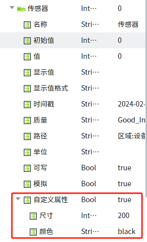
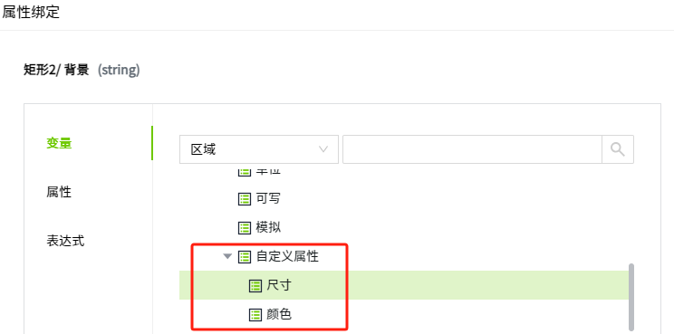

# Custom

Custom property refer to properties that users add to tag to meet their specific application needs, such as color, size, shape, etc., in order to better satisfy their monitoring and control requirements.

## **How to Enable**

 Click the Add button to add custom properties. 

 Click the Add button to add custom property .

| **Name** | **Description**                                                                       |
|----------|---------------------------------------------------------------------------------------|
| Name     | Required.The name of the customized property.                                         |
| Type     | Required.Drop-down selection with Integer, Double, Bool, String, DateTime.            |
| Value    | Required.Depending on the type of data selected, different input boxes are displayed. |

 In the Assets window,expand t ag and under the Custom node, you can view the custom properties that have been set.

 Custom properties are the same as the properties that come with the tag and can be bound.

