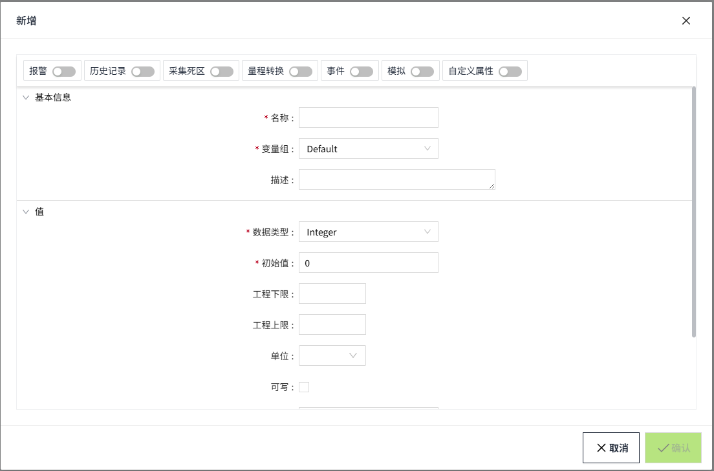

# 变量属性

变量包含的 属性具体取决于用户创建的变量类型，以及用户开启的属性 配置。

新增页面，默认只显示“基础属性”、“值”这两个配置信息。其他配置均处于未启用状态。开启对应的配置后，才会在下图的新增界面上显示对应的配置项信息。

**注意**：

1. 当变量数据类型选择的是Double时，系统最大只支持小数点后15位。

2. 如果配置了某个配置项后又将其配置项取消并保存了变量。则下次在该变量上再次启用该配置时，自动显示上次的配置结果。

### I/O变量

I/O变量包含如下属性：

- 基本信息
- 值
- 报警
- 历史记录
- 采集死区
- 量程转换
- 事件
- 模拟
- 自定义属性

### 内存变量

内存变量包含如下属性：

- 基本信息
- 值
- 报警
- 历史记录
- 采集死区
- 事件
- 模拟
- 自定义属性

### 表达式变量

表达式变量包含如下属性：

- 基本信息
- 值
- 报警
- 历史记录
- 采集死区
- 量程转换
- 事件
- 模拟
- 自定义属性

