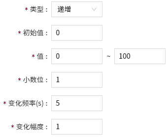
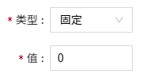
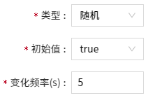

# 模拟

变量的模拟属性在VC Hub系统中具有重要的作用，它们通常用于模拟和表示与实际过程相关的连续性数据。

以下是模拟属性在VC Hub系统中的一些常见应用：

- **过程模拟：** 模拟属性可用于模拟实际过程中的参数，如温度、压力、流量等。这有助于操作员了解系统的行为，进行培训以及测试和优化控制算法，而无需实际操作和风险。
- **仿真：** 使用模拟属性，VC Hub系统可以创建虚拟环境，用于培训操作员和测试控制系统的性能。这种仿真环境可以模拟各种场景，包括正常运行、紧急停机和设备故障等，以提高操作员的应对能力。
- **数据分析和趋势预测：** 模拟属性生成的数据可以用于进行数据分析和趋势预测。通过观察模拟数据的变化，可以识别潜在的趋势和模式，从而做出更加准确的预测和决策。

变量开启了模拟后，不管是否绑定数据源，都将使用模拟值进行数据推送。

**示例**

模拟水位的变化。

1. 创建一个内存变量：液位，开启模拟属性，参数设置如下：

    - 类型：递增
    - 初始值：10
    - 值：20~60
    - 变化频率(s)：1
    - 变化幅度：5

2. 在画面上绘制一个矩形，并设置填充动画。

    

3. 查看运行效果。

    

#### 如何启用

在变量的设置弹窗中，顶部有模拟的开关，开启后进行模拟设置。

打开后，弹窗中会自动显示模拟配置项，用户可以根据实际需求，设置模拟数据，设置完成后点击”确认“按钮即可。

#### 按数据类型配置模拟

不同数据类型的变量，模拟配置也不同。

###### Integer

随机：

递增、递减：

固定：

| **配置** | **描述**|
|:----------|:-------------------------------------------------------------------------------------------------------------------------------------------------------------------------------------------------------------------------------|
| 类型     | 默认随机。可以下拉选择随机、递增、递减、固定。|
| 初始值   | 必填，默认0。类型为随机、递增、递减时，显示该属性。设置模拟的初始值。|
| 值（范围） | 必填，默认0到100。类型为随机、递增、递减时，显示该属性。 设置模拟的值范围 。|
| 变化频率 | 必填， 默认5。仅支持正整数，单位为s。类型为随机、递增、递减时，显示该属性。设置模拟数据的变化频率。|
| 变化幅度 | 必填，默认1。类型为**递增、递减** 时，显示该属性。设置模拟值每次的变化幅度。按照初始值±变化幅度进行变化。    递增时，如果当前值+ 变化幅度 > 最大值，则下一个值重回最小值；    递减时，如果当前值 - 变化幅度 < 最小值，则下一个值重回最大值。 |
| 值       | 必填，默认0。类型为固定时，显示该属性。始终使用该值作为模拟值，数值不会发生变化。|

###### Double

随机：

递增、递减：

固定：

| **配置** | **描述** |
|:----------|:---------------------------------------------------------------------------------------------------------------------------------------------------------------------------------------------------------------------------|
| 类型     | 默认随机。可以下拉选择随机、递增、递减、固定。|
| 初始值   | 必填，默认0。类型为随机、递增、递减时，显示该属性。设置模拟的初始值。|
| 值（范围） | 必填，默认0到100。类型为随机、递增、递减时，显示该属性。 设置模拟的值范围 。|
| 小数位   | 必填，默认为 1 。支持 1~16 之间的正整数。设置模拟值的小数位数。|
| 变化频率 | 必填， 默认5。仅支持正整数，单位为s。类型为随机、递增、递减时，显示该属性。设置模拟数据的变化频率。|
| 变化幅度 | 必填，默认1 。类型为递增、递减时，显示该属性。设置模拟值每次的变化幅度。按照初始值±变化幅度进行变化。    递增时，如果当前值+ 变化幅度 > 最大值，则下一个值重回最小值；    递减时，如果当前值 - 变化幅度 < 最小值，则下一个值重回最大值。 |
| 值       | 必填，默认0。类型为固定时，显示该属性。始终使用该值作为模拟值，数值不会发生变化。|

###### Bool

随机：

取反：

固定：

| **配置** | **描述** |
|:----------|:---------------------------------------------------------------------------------------------------------------------------------------------------------------------------------------------------------------------------------------------|
| 类型     | 默认随机。可以下拉选择随机、取反、固定。|
| 初始值   | 必填，默认 true 。类型为随机、取反时，显示该属性。设置模拟的初始值。|
| 变化频率 | 必填, 默认 5 。仅支持正整数，单位为 s 。类型为随机、取反时，显示该属性。设置模拟数据的变化频率。    当类型为随机时，下一个值在true 和 false 之间随机变化；    当类型为取反时，若当前值为 true, 则下一个值为 false;  若当前值为false ，则下一个值为 true. |
| 值       | 必填，默认 true。类型为固定时，显示该属性。下拉选择true、false。始终使用该值作为模拟值，数值不会发生变化。|

###### String

随机：

循环：

固定：

| **配置** | **描述**|
|:----------|:-------------------------------------------------------------------------------------------------------------------------------------------------------------------------------------------------------------|
| 类型     | 默认随机。可以下拉选择随机、循环、固定。|
| 初始值   | 必填 , 默认 abc 。类型为随机、循环时，显示该属性。设置模拟的初始值。|
| 模拟值   | 必填。设置需要产生的模拟数据。点击 + ，进行添加。|
| 变化频率 | 必填, 默认 5 。仅支持正整数，单位为 s 。类型为随机、循环时，显示该属性。设置模拟数据的变化频率。   当类型为随机时，下一个值在模拟值中随机选择一个；   当类型为循环时，下一个值在模拟值中按照添加顺序从前到后循环显示。 |
| 值       | 必填 , 默认 abc 。类型为固定时，显示该属性。默认为空。始终使用该值作为模拟值，数值不会发生变化。 |

###### DateTime

| **配置** | **描述**|
|:----------|:-------------------------------------------------------------------------------|
| 类型     | 默认实时值， 仅此一个选项。获取服务器的当前时间。                                |
| 变化频率 | 必填 , 默认5。仅支持正整数，单位为s。用于设置每隔多少秒获取一次服务器的当前时间。 |