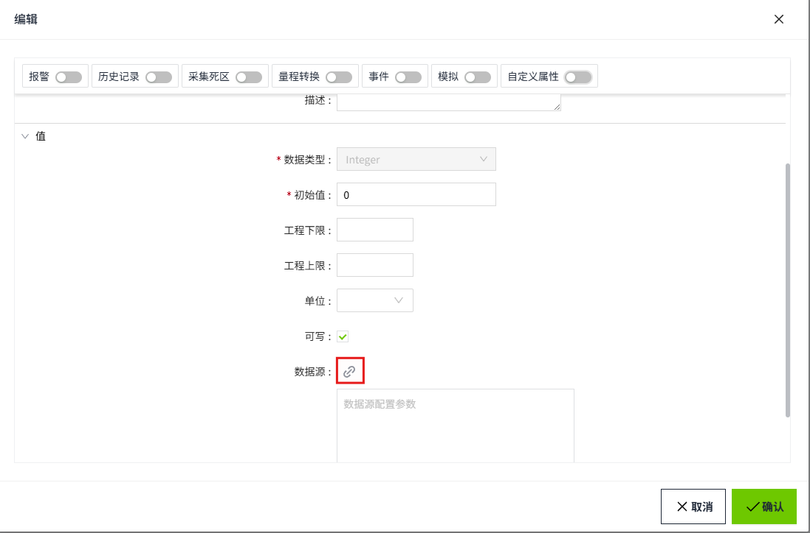

# 变量类型

WAGO VC Hub中的变量类型包括：

- 内存变量
- I/O变量
- 表达式变量
- 系统变量

其中，内存变量、I/O变量、表达式变量允许创建，系统变量是内置的，不支持创建。

用户可创建的变量类型在资产树中都有自己的图标：

| **图标**| **变量类型** |
|:------------------------------------------------------------------------------------------------------------------------------------------------------------------------------------------------------------|:--------------|
|  | 内存变量     |
|  | I/O变量      |
|  | 表达式变量   |

### 内存变量

内存变量是简单的变量， 不会自动轮询或更新其值。它们 保持相同的值，直到某个由 其他用户创建的机制（可能是脚本或绑定）改变它们的值 。

### I/O变量

 通过绑定外部设备获取其值。

I/O变量通过数据源属性绑定设备。

### 表达式变量

 通过编写表达式，计算并 确定其值。

表达式变量必须设置 **源变量路径**、**表达式（读值）和表达式（写值）**。

| **属性**     | **描述**|
|:--------------|:-----------------------------------------------------------------------------------------------------|
| 源变量路径   | 可以直接输入变量Path或选择变量。只可填写 一个变量。                                                   |
| 表达式（读值） | 默认显示{Source}，{Source}代表源变量的值。可以将源变量通过表达式计算后获取的新值作为当前变量读到的值。 |
| 表达式（写值） | 默认显示{Value}，{Value}表示源变量的原始值。此表达式确定应写入当前变量的值。                           |

**示例**

将华氏度转化为摄氏度显示。

1. 创建一个表达式变量，名称为：摄氏温度
2. 设置源变量，选择源变量“华氏温度”，该变量的值是个华氏温度。
3. 设置表达式(读值)为：( {Source} - 32) × 5/9
4. 设置表达式(写值)为：( {Value} × 9/5) + 32

