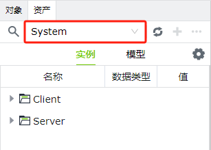
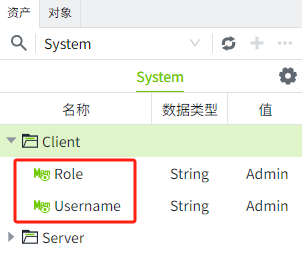

# 系统变量

系统变量用于显示当前系统相关的状态信息，如报警数据，内存使用情况、性能指标等，系统变量不能删除或修改。

您可以在资产窗口中，选择名为”System“的资产，查看详细的系统变量。

系统变量包含Client和Server目录。

**Client**：用户登录WAGO VC Hub时使用的设备，如办公电脑等；

**Server**：安装了WAGO VC Hub的设备。

**Client** 目录包含UserName和Role。**只读**，不可编辑。

| **属性** | **描述**                  | **数据类型** |
|:----------|:---------------------------|:--------------|
| UserName | 当前登录的用户名，例如：Sam | String       |
| Role     | 当前登录的角色，例如：Admin | String       |

Server文件夹包含以下变量：

详细信息如下表所示：

| **属性** | **描述**  | **数据类型** |
|:------------------------------------------------------------------------------------------------------------------------------------------------|:------------------------------------------------------------------------------------------------------------------------------------------------------------------------------------------------------------------------------------------------------------------------------------------------------------------------------------------------------------------------------------------------------------------------------------------------------------------------------------------------------------------------------------------------------------------------------------------------------------------------------------------------------------------------------------------------------------------------------------------------------------------------------------------------------------------------------------------------------------------------------------------------------------------------------------------------------------------------------------------------------------------------------------------------------------------------------------------------------------------------------|:--------------|
| CurrentDateTime | 当前系统所在服务器的时间。 | DateTime     |
| NodeName  | 当前系统的节点名称。| String       |
| Timezone  | 当前系统所在服务器的时区。| String       |
| **Alarm**  | |              |
| ActiveAcked | 当前处于激活，已确认状态的报警条数。 | Integer      |
| ActiveUnacked  | 当前处于激活，未确认状态的报警条数。| Integer      |
| ClearAcked | 当前处于已清除，已确认状态的报警条数。 | Integer      |
| ClearUnacked | 当前处于已清除，未确认状态的报警条数。 | Integer      |
| **Devices**(每个设备类型一个独立文件夹。每个设备类型文件夹下，每个设备显示为一个独立文件夹，在设备文件夹下显示2个系统变量：Connected，Enabled。) | 
| Connected | 当前设备的连接状态，已连接显示为true，未连接显示为false。 | Bool         |
| Enabled | 当前设备的启用状态，已启用接显示为true，禁用显示为false。可以在设备列表的“启用状态”一列，进行启用和禁用。  MQTT Native和WAGO Protocol设备只有Enabled变量。| Bool         |
| **Performance** | |              |
| AvailableDiskSpace  | 当前系统所在磁盘的可用空间，单位为M(兆)，精确到小数点后1位。如1200.5，表示1200.5M。 | Double       |
| CPUUtilization | 当前系统的CPU使用率，精确到小数点后3位。如：0.043，表示4.3%。| Double       |
| DiskUtilization  | 当前系统的磁盘使用率，精确到小数点后3位。如：0.028，表示2.8%。| Double       |
| MaxMemory | 当前系统所在服务器的最大运行内存，单位为M(兆)，精确到小数点后1位。如15986，表示15986M。| Double       |
| MemoryUsage | 当前系统已使用的内存，单位为M，精确到小数点后1位。如1899，表示1899M。| Double       |
| MemoryUtilization | 当前系统的内存使用率，精确到小数点后3位。如：0.083，表示8.3%。| Double       |
| **Redundancy** | |              ||              |
| **CurrentNode**| |              ||              |
|IsActive | 当前节点是否处于活动状态。| Bool   | 
| IsMaster | 当前节点是否是主节点。| Bool   | 
| Mode     | 当前节点的工作模式。包含：Independent(独立)，Redundancy(冗余)，Master(主服务器)，Backup(备用服务器)，Unknown(未知)。| String | 
| State    | 当前节点的状态。  如果当前节点是主节点，则该状态的值为Running，Standby，Connecting，Disconnected，Faulted，Other的其中之一；  如果当前节点是备节点，则该状态的值为Standby_Cold(冷备)或Standby_Warm(热备)。 | String | 
| **PeerNode** | |              ||              |
|IsConnected | 是否和其他节点连接，形成冗余。 | Bool   | 
| NodeId      | 连接到的节点的Id。            | String |

Server目录下的系统变量支持编辑，双击变量或者在变量的右键菜单中选择“编辑”，打开编辑窗口。

