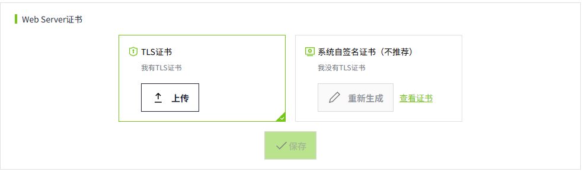

# 证书管理

用来统一管理证书。每类证书独立保存。包含：

- **Web Server证书**：用于配置 Web 客户端（如浏览器）与 VC Hub 服务器之间安全通信的证书。
- **冗余、组网证书**：用于配置多个 VC Hub 节点在冗余或组网模式下安全通信的证书。
- **MQTT Broker证书**：用于配置 MQTT 客户端（如现场设备或 VC Hub 客户端）与 MQTT Broker 之间安全通信的证书。

## Web Server证书

默认选择 **TLS证书**。

- 如果用户有 TLS 证书，可以点击 TLS 证书的 **上传** 按钮，上传一个TLS证书。
- 如果用户没有 TLS 证书，可以选择 **系统自签名证书**。使用系统自带的证书进行通信。点击 **重新生成** 按钮，将重新生成一张自签名证书。

证书设置完成后，可以点击“查看证书”按钮，查看证书的详细信息。

## 冗余、组网证书

默认选择 **TLS证书**。

- 如果用户有 TLS 证书，可以点击 TLS 证书的 **上传** 按钮，上传一个 TLS 证书。
- 如果用户没有 TLS 证书，可以选择 **系统自签名证书**。使用系统自带的证书进行通信。点击 **重新生成** 按钮，将重新生成一张自签名证书。

证书设置完成后，可以点击“查看证书”按钮，查看证书的详细信息。

**说明：** 在进行冗余或者组网配置前，要先在此处为其设置证书。

## MQTT Broker证书

默认选择 **TLS证书**。

- 如果用户有 TLS 证书，可以点击 TLS 证书的 **上传** 按钮，上传一个 TLS 证书。
- 如果用户没有 TLS 证书，可以选择 **创建自签名证书**。系统内置了一个自签名证书，您也可以点击 **创建** 按钮，重新创建一张自签名证书。

证书设置完成后，可以点击“查看证书”按钮，查看证书的详细信息。

**说明：** 在为 MQTT Broker 启用 TLS 前，要先在此处为其设置证书。