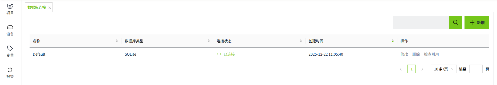
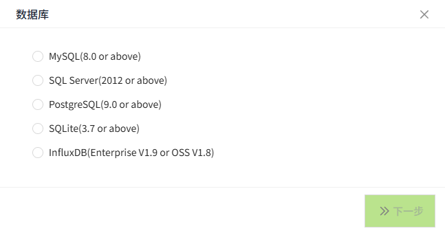
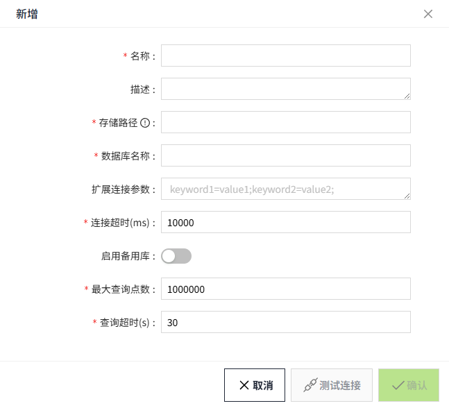

# 数据库连接

## 创建连接

1. 在”**数据库**“->”**数据库连接**“页面，点击“**新增**”按钮。

    

2. 在弹出的如下窗口中，选择需要添加的数据库类型。选择完成，点击“下一步”按钮。

    

3. 依据所选的数据库类型，显示不同的配置界面。

    当选择MySQL、SQL Server、PostgreSQL时，显示如下配置界面：

    

    当选择InfluxDB时，显示如下配置界面：

    

    当选择SQLite 时，显示如下配置界面：

    

4. 设置完成后，点击”确认”按钮，保存数据。

**配置项说明**

| **配置项**   | **说明**|
|:--------------|:----------------------------------------------------------------------------------------------------------------------------------------------------------------------------------------------------------------------------------------|
| 名称         | 数据库连接的名称。|
| 描述         | 该配置的描述说明。|
| Host         | 数据库的地址。  例如SQL Server服务器地址为 10.1.102.21:1433，那么Host为10.1.102.21 |
| 端口         | 数据库的端口。  例如SQL Server服务器地址为 wago-sz-VC Hub:1433，那么Port为1433|
| 使用SSL      | 当选择InfluxDB时显示该字段。|
| 数据库名称   | 当类型为MySQL、SQL Server、PostgreSQL、InfluxDB时，为数据库名称。  当类型为SQLite时，为SQLite文件名（不需要.db的后缀名）。|
| 用户名       | 当选择MySQL、SQL Server、PostgreSQL、InfluxDB时显示该字段。连接数据库时要使用的用户名。|
| 密码         | 当选择MySQL、SQL Server、PostgreSQL、InfluxDB时显示该字段。连接数据库时要使用的密码。|
| 扩展连接参数 | 根据要连接到的数据库，此框中可填写不同的值。每个数据库都有自己的一组可用的额外连接属性，因此您必须参考数据库文档来确定此处的有效属性。|
| 连接超时     | 和数据库的连接超时时间。|
| 启用备用库   | 当前连接不可用时，是否启用备用连接。 |
| 备用库       | 当此连接不可用时自动使用的连接。|
| 主备切换模式 | 允许您选择如何处理数据库连接失败和恢复。   **平等模式**：当前连接无法使用时，会转移使用备用库连接，但当此连接恢复时，将继续使用备用库。   **主备模式**：当前连接无法使用时，会转移使用备用库连接，但当此连接恢复时，将重新恢复使用此连接。          |
| 最大查询点数 | 当选择MySQL、SQL Server、PostgreSQL、SQLite时显示该字段。用于定义针对某个数据库，执行一次查询时可以检索的最大数据点数量。|
| 查询超时     | 当选择MySQL、SQL Server、PostgreSQL、SQLite时显示该字段。用来定义针对某个数据库进行数据查询时，最多可以持续多长时间。如果查询在指定的时间内未完成，则系统会自动中止该查询。这个设置有助于防止系统因长时间的查询操作而陷入性能瓶颈或者卡顿状态。 |

