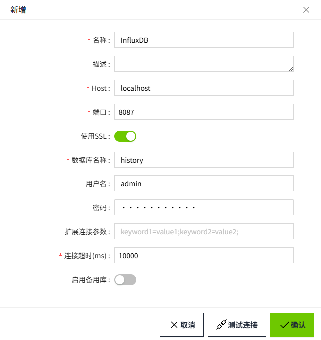

# InfluxDB

InfluxDB是一个专注于海量时序数据的高性能时序型数据库，支持灵活的自定义保留策略和类SQL的操作接口等。

WAGO VC Hub支持 **InfluxDB Enterprise** 版本和 **InfluxDB OSS V1** 版本，暂不支持 **InfluxDB OSS V2** 版本。

在此页面上，我们将演示如何将WAGO VC Hub连接到 InfluxDB。

1. 在“**数据库**”->“**数据库连接**”页面，点击“**新增**”按钮。

      

2. 在弹出的如下窗口中，选择 InfluxDB，点击“下一步”按钮。

      

3. 获取 InfluxDB 服务器相关信息，Host、端口、使用 SSL、用户名、密码等，将获取信息填写进配置框后保存。（说明：以下数据仅为示例，请根据实际情况填写）。

      

      - 名称：InfluxDB
      - Host: localhost
      - 端口：8087
      - 使用SSL：启用
      - 启用SSL：数据在 WAGO VC Hub 和 InfluxDB 服务器之间通过加密通道传输，确保数据的机密性和完整性，防止第三方监听或篡改数据。这对于处理敏感信息非常重要。
      - 数据库名称：history
      - 用户名：admin
      - 密码：admin@12345 
      - 连接超时(ms)：10000

4. 点击“确认”按钮，弹窗关闭，显示数据库连接列表。在列表中该条数据的连接状态显示为“连接成功”。

      

