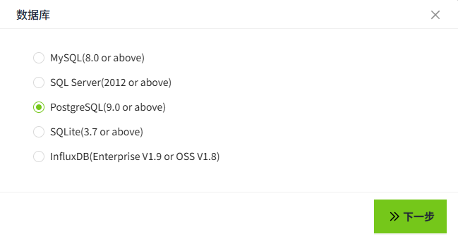
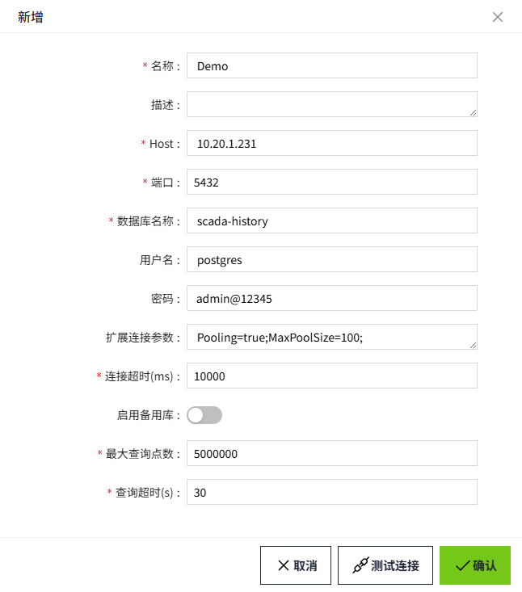

# PostgreSQL

在此页面上，我们将演示如何将WAGO VC Hub连接到 PostgreSQL。

1. 在”**数据库**“->”**数据库连接**“页面，点击“**新增**”按钮。

    

2. 在弹出的如下窗口中，选择PostgreSQL，点击“下一步”按钮。

    

3. 获取PostgreSQL服务器连接字符串信息, 例如下面两种格式：

    User ID=postgres;Password=admin@12345;Host=10.20.1.231;Port=5432;Database=scada-history;Pooling=true;MaxPoolSize=100;

    jdbc:postgresql://10.20.1.231:5432/scada-history?user=postgres&password=admin@12345&Pooling=true&MaxPoolSize=100;

    在配置界面输入如下信息（说明：以下数据仅为示例，请根据实际情况填写）。

    
    
    - 名称：Demo
    - Host: 10.20.1.231
    - 端口：5432
    - 数据库名称：scada-history
    - 用户名：postgres
    - 密码：admin@12345 
    - 扩展连接参数：Pooling=true;MaxPoolSize=100;
    - 连接超时(ms)：10000
    - 最大查询点数：5000000
    - 查询超时(s)：30

4. 点击“确认”按钮，弹窗关闭，显示数据库连接列表。在列表中该条数据的连接状态显示为“连接成功”。

    

