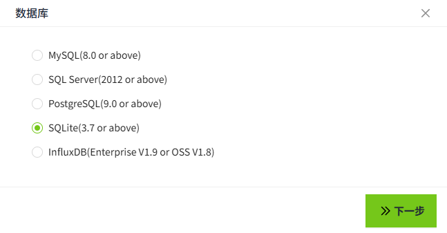
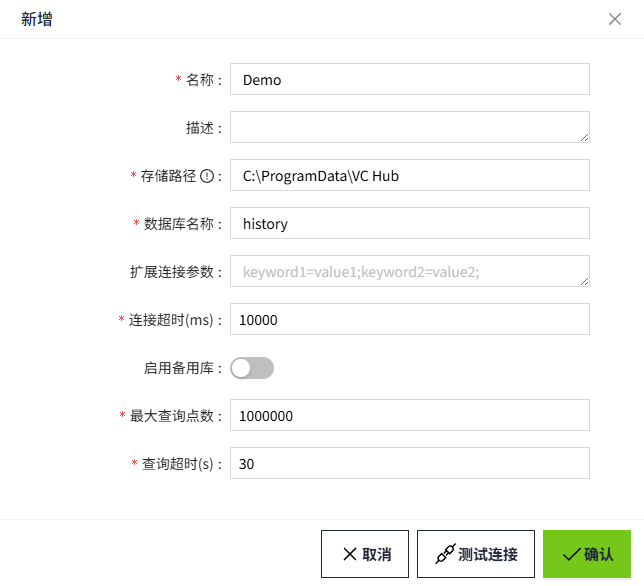

# SQLite

在此页面上，我们将演示如何将WAGO VC Hub连接到 SQLite。

1. 在”**数据库**“->”**数据库连接**“页面，点击“**新增**”按钮。

    

2. 在弹出的如下窗口中，选择SQLite，点击“下一步”按钮。

    

3. 在配置界面输入如下信息（说明：以下数据仅为示例，请根据实际情况填写）。

    由于SQLite 是一个开源的嵌入式关系数据库，实现了自给自足的、无服务器的、配置无需的、事务性的 SQL 数据库引擎。它是一个零配置的数据库。

    所以在创建SQLite数据库连接也就意味着在本地创建了SQLite文件。所以无需Host、Port、用户名、密码等信息，只需要确认SQLite文件存放位置即可。

    

    - 名称：Demo
    - 数据库名称：history
    - 连接超时(ms)：10000
    - 最大查询点数：1000000
    - 查询超时(s)：30

    **说明**：数据库名称是指SQLite文件名称，不需要填写后缀。 

4. 点击“确认”按钮，弹窗关闭，显示数据库连接列表。在列表中该条数据的连接状态显示为“连接成功”。

    
