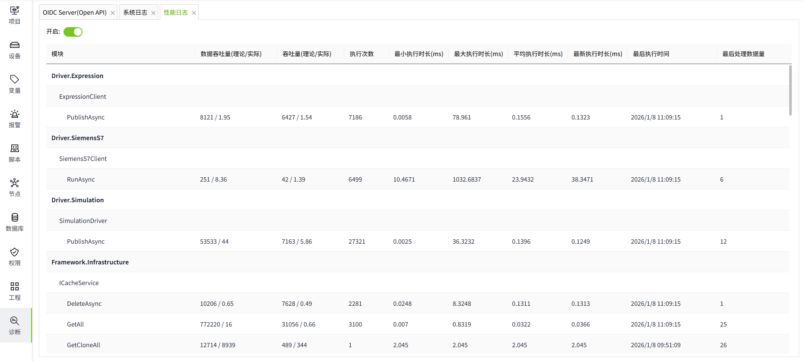
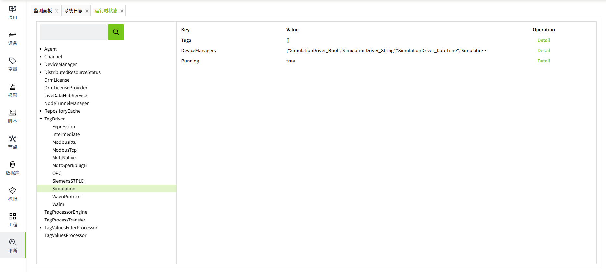
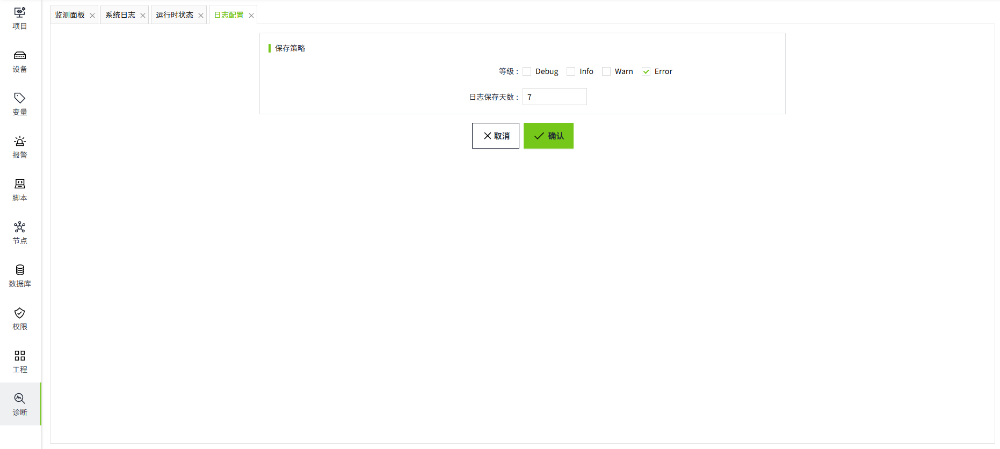

# 诊断

诊断模块通常情况下是运维人员进行系统诊断、故障排除的工具，主要用于查询服务器状态、日志等信息。

您可以在"诊断"菜单下，查看相关日志数据。

## 监测面板

监测面板用于实时监测和展示各项关键指标和数据，帮助用户更好地了解系统运行情况，并及时发现和解决可能存在的问题。

监测的指标：

- CPU平均利用率

- Memory利用率

- Memory使用

#### CPU利用率

通过数值和折线图查看当前CPU使用状态。当CPU利用率超过100%时，并不是代表CPU超负荷运算，而是和CPU的核心数量相关，比如服务器CPU有8个核心，那么CPU利用率的百分比基数就是800%。

#### Memory利用率

通过数值和折线图查看当前服务器内存使用百分比。

#### Memory使用

通过图中的具体内存使用数值，可以清楚地查看当前服务器内存使用了多少MB。

## 系统日志

用户可在“诊断”->“系统日志”页面，查看程序记录的系统日志。

| **图标** | **等级** |
|:------------------------------------------------------------------------------------------------------------------------------------------------------------------------------------------------------------|:----------|
|  | Debug    |
|  | Info     |
|  | Warn     |
|  | Error    |

用户点击任意数据右侧的 “详情” 按钮查看具体日志内容。

**筛选**

- 时间范围：默认范围为当日零点~次日零点，用户可根据需求，修改时间范围进行筛选查询，但是时间跨度不可超过 24 小时。
- 日志等级：用户可通过日志等级筛选日志，目前支持4个等级，Debug、Info、Warn、Error，在选择 All 的条件下，将查询所有等级的日志。
- 日志内容：用户可输入日志内容关键字进行模糊匹配。

在输入条件后点击 “查询” 按钮即可。

**导出**

用户可通过点击导出按钮，导出当前筛选条件下查询出的所有数据，下载为Excel文件。

## 性能日志

在"诊断"->"性能日志"页面，可以查看核心模块的执行效率。

默认关闭，开启后查看性能日志。

## 运行时状态

在"诊断"->"运行时状态"页面，可以查看模块的执行状态。点击右侧的”Detail”按钮，查看详细信息。

## 日志配置

用于配置系统日志的存储策略。

系统默认的存储策略为只记录 Error 类型的日志，且仅保留 7 天。您可根据需要自行修改，修改时应该考虑硬盘大小，不建议将日志保存天数设置过长。

## 事件配置

用于配置变量事件的存储策略。此处记录的事件可在 “实时事件” 和 “历史事件” 控件上进行展示。

默认事件过期天数为 180 天，系统会按照设置的过期天数定时清理陈旧数据。

