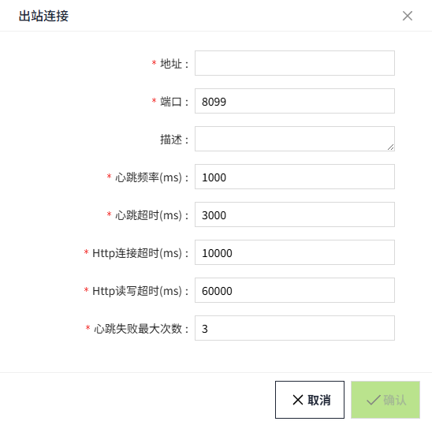
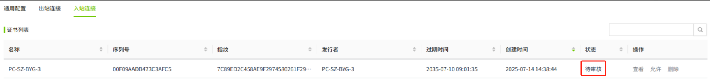

# 组网

组网模块可以让多个VC Hub节点连接起来，组成一个去中心化的分布式集群。

组网模块提供了以下的功能：

- 一个基于web socket 的隧道网络，VC Hub节点之间可以通过这个隧道网络收发数据。
- 跨节点远程资产树访问，其他VC Hub实例可以访问当前VC Hub实例关联的远程资产树。
- 基于白名单或者手动审核的入站连接安全配置，也可以随时禁用入站连接，提高连接安全性。
- SSL 协议支持，启用 SSL 后，入站连接必须发起安全连接；且只有在入站连接的证书通过审核后，该连接才能成功建立。
**说明**：形成组网的多个节点，版本必须完全一致，否则会导致部分功能异常。 

## 组网的服务器之间数据互通

服务器A和服务器B形成了组网，服务器B又和服务器C形成了组网，那么在服务器A也能看到服务器C的资产信息。

## 组网配置步骤

以下步骤将帮助您快速了解组网的配置流程，希望对您有所帮助。以节点A和节点B配置组网为例。

**示例1：节点A和节点B的Trust Store中未上传对方节点的授信证书**

步骤1：在节点A的”节点“->"证书管理"页面，设置冗余、组网证书。

步骤2：在节点A的”节点“->"组网"的“通用配置“页面，开启组网。“需要双向认证”不开启。

步骤3：在节点B的”节点“->"证书管理"页面，设置冗余、组网证书。

步骤4：在节点B的”节点“->"组网"的“通用配置“页面，开启组网。

步骤5：在节点A的”节点“->"组网"页面的”出站连接“页面，新建一个出站连接，出站地址为节点B的地址(例如：节点名称或Host等)。

步骤6：在节点B的”节点“->"组网"的“入站连接”页面，在证书列表中允许节点A的证书。允许后，在入站连接列表中将显示节点A的信息。

步骤7：在节点B的”节点“->"组网"的“入站连接”页面，在入站连接列表中允许节点A的连接。此时节点A和节点B形成组网。

**说明**：如果节点A开启了“需要双向认证”，完成上述第5步后，在“出站连接“页面的证书列表中会显示节点B的证书，允许该证书后，再继续后续步骤。 

**示例2：已在节点A和节点B的Trust Store中上传了对方节点的授信证书**

步骤1：在节点A的”节点“->"证书管理"页面，设置冗余、组网证书。

步骤2：在节点A的”节点“->"组网"的“通用配置“页面，开启组网。“需要双向认证”不开启。

步骤3：在节点B的”节点“->"证书管理"页面，设置冗余、组网证书。

步骤4：在节点B的”节点“->"组网"的“通用配置“页面，开启组网。

步骤5：在节点A的”节点“->"组网"页面的”出站连接“页面，新建一个出站连接，出站地址为节点B的地址(例如：节点名称或Host等)。

步骤6：在节点B的”节点“->"组网"的“入站连接”页面

- 如果节点A的组网证书的根证书，存在于节点B的trust store中，则证书会被自动允许，不显示在证书列表中，仅在入站连接列表中显示节点A的信息。
- 如果节点A的组证书的根证书，不存在于节点B的trust store中，在证书列表中显示节点A的证书，允许证书后，在入站连接列表中将显示节点A的信息。

步骤7：在节点B的”节点“->"组网"的“入站连接”页面，在入站连接列表中允许节点A的连接。此时节点A和节点B形成组网。

**说明**：如果节点A开启了“需要双向认证”，完成上述第5步后，  
- 如果节点B的组网证书的根证书，不存在于节点A的trust store中，在节点A的“出站连接“页面的证书列表中会显示节点B的证书，允许该证书后，再继续后续步骤。 
- 如果节点B的组网证书的根证书，存在于节点A的trust store中，则在节点A的出站连接页面，节点B的证书无需手动允许，会被自动允许，且不显示在证书列表中。之后可以继续后续步骤。

## 组网通用配置

用户点击“**节点**”>“**组网**”后可以看到组网的通用配置页面。

| **配置项**       | **说明**|
|:------------------|:------------------------------------------------------------------------------------------------------------------------------------------------------------------------------------------------------------------------------------------------------------------------------------------------------------------------------------------------|
| 启用             | 启用后，组网和冗余功能才生效。|
| 端口             | 默认8099, 组网监听端口。|
| 需要双向认证     | 执行双向 TLS 身份验证。如果为 “true”，在当前节点的出站列表中需要信任对方节点的证书。|
| 允许入站连接     | 取消勾选后，所有入站连接都会被拒绝。|
| 连接策略         | 入站连接的审核策略，连接策略选项如下：   1. 仅授权：默认策略，当入站连接建立后，入站连接无法被用来收发数据。用户在入站连接管理页面找到对应的入站连接，然后点击允许后，入站连接才可以收发数据。  2. 无限制：选择无限制后，入站连接建立后可以直接收发数据。  3. 指定节点名称：当入站连接的节点名称包含在指定节点名称的列表中，这个入站连接创建后可以直接收发数据。 |
| 指定节点名称     | 节点名称的列表，默认隐藏。用户在连接策略中选择了指定节点名称后，这个配置可见。当入站连接的节点名称包含在指定节点名称的列表中，这个入站连接创建后可以直接收发数据。|
| 心跳频率         | 单位毫秒，入站连接创建后，向远程连接发送心跳的频率。|
| 心跳超时         | 单位毫秒，入站连接创建后，向远程连接发送心跳的超时时间。|
| 心跳失败最大次数 | 单位毫秒，入站连接创建后，心跳失败的次数超过最大次数后，这个入站连接会被判定为不可用。|

## 出站连接管理

当前节点需要连接到另一个节点时，可以在当前节点创建一个出站连接。

**注意**： 为了便于描述，在下文中用 **节点A** 表示当前节点，用 **节点B** 表示另一个节点。

**新增出站连接**：点击“新增”按钮后会弹出新增窗口，填入另一个节点的地址和端口后确认，一个出站连接即创建完成。

| **配置项**       | **说明**|
|:------------------|:------------------------------------------------------------------------------------|
| 启用             | 取消勾选后该出站连接被禁用                                                         |
| 地址             | 远程VC Hub进程的网络地址                                                           |
| 端口             | 默认8099, 远程VC Hub节点的组网监听端口,                                            |
| 描述             | 该出站连接的描述信息。                                                              |
| 心跳频率         | 单位毫秒，入站连接创建后，向远程连接发送心跳的频率。                                  |
| 心跳超时         | 单位毫秒，入站连接创建后，向远程连接发送心跳的超时时间。                              |
| Http连接超时     | 单位毫秒，默认10000，http请求连接远程VC Hub进程的超时时间。                           |
| Http读写超时     | 单位毫秒，默认10000，http请求发送数据到远程VC Hub进程的超时时间。                     |
| 心跳失败最大次数 | 单位毫秒，入站连接创建后，心跳失败的次数超过最大次数后，这个入站连接会被判定为不可用。 |

在出站连接页面用户可以看到当前已经创建的出站连接，以及出站连接的状态。

#### 操作出站连接列表 

在 **节点A** 上添加出站连接，出站连接地址填写 **节点B** 的节点名称或Host。

添加后，在出站连接列表显示的内容，会随着 **节点A** 的“通用配置”的不同而不同，分为以下两种情况：

1. 如果在 **节点A** 的组网的通用配置中未开启“需要双向认证”，在出站连接页面仅显示出站连接列表。

      

      刚创建出站连接后，节点的出站连接的状态显示为**Faulted**。

      出站连接列表中的数据的状态，取决于在**节点B**的入站连接页面对证书和入站连接进行的操作。

      只有在**节点B**的入站连接页面，对证书和入站连接全部允许，在出站连接中，出站地址的状态才会显示为  **Running**。

2. 如果在**节点A**的组网的通用配置中开启了”需要双向认证“，在出站连接页面显示出站连接列表和证书列表。

      

      这种情形下，需要先在 **节点A** 的 **出站连接** 页面的证书列表中允许 **节点B** 的证书后，在 **节点B** 的入站连接列表中才显示当前节点的信息。

      在同时满足下列条件时，节点A的出站地址的状态才会显示为“**Running**”：

      a. 在 **节点A** 的出站连接页面，在证书列表中允许了 **节点B** 的证书 

      b. 在 **节点B** 的入站连接页面:

      - 在证书列表中允许 **节点A** 的证书。

      - 在入站连接列表中允许 **节点A** 的连接  2

**操作出站连接**：在出站连接列表中，可以对出站连接进行启用，修改和删除。

- **启用**：启用出站连接。
- **修改**：点击后弹出修改窗口，可以修改出站连接配置。
- **删除**：删除该出站连接节点。删除后，如果该节点已和其他节点形成了组网，则组网会断开。

**操作证书**：在证书列表中，可以对证书进行允许，拒绝，查看和删除操作。

- **允许**：允许该出站节点的证书。
- **拒绝**：拒绝该出站节点的证书。拒绝后，无法和此节点形成组网。
- **删除**：删除此条数据。删除后，无法和此节点形成组网。
- **查看**：点击证书的查看按钮，弹出查看窗口，可以查看该证书的详细信息。

#### 入站连接管理

在节点A上添加节点B作为出站地址后，在 **节点B** 的 **入站连接** 页面的证书列表和入站连接列表中显示 **节点A** 的信息。

在入站连接页面 **允许节点A的证书和入站连接** 后，形成组网。

**举例说明**：

1. 当节点A创建一个出站连接，地址填写B节点的信息。在节点B的入站连接页面可以看到节点A的证书，证书的默认状态为”待审核”。

      

2. 在节点B的入站连接页面的证书列表中，"允许"节点A的证书后，入站连接列表中会显示一条节点A的入站连接。默认状态为”待审核”。

      

3. 在入站连接列表中，允许节点A，完成组网。
4. 此时，节点A的出站连接列表中，节点B的状态显示为“**Running**"。

**说明**：

如果在上述节点A的通用配置中开启了”需要双向认证“，需先在节点A的出站连接的证书列表中允许节点B的证书后，再在节点B的入站连接列表中允许节点A的证书和连接，之后节点A和节点B才能形成组网。

#### 操作入站连接列表

**操作证书**：在入站连接页面的证书列表中，我们可以对证书进行如下操作：允许，删除，查看，拒绝。

- **允许**：创建连接后，证书默认待审核状态，需手动允许该证书。

允许后，证书状态显示为”允许“。

- **拒绝**：点击证书列表中的拒绝按钮，可以将已经允许的证书的状态修改为“拒绝”，当一个证书的状态被设置为“拒绝”后，和这个证书关联的所有的入站或出站连接都会被中断。

- **查看**：点击证书的查看按钮，弹出查看窗口，可以查看该证书的详细信息。
- **删除**：点击证书列表中的删除按钮后，会从证书列表移除该证书。需要注意的是，如果此时某个远程节点正在使用这个证书尝试与当前节点建立连接，那这个证书删除后会被立即重新创建出来。

**操作入站连接**：需先在入站连接的证书列表中允许节点的证书后，才会在入站连接列表中显示该节点的入站连接信息，从而对其进行操作。

1.  **允许**：入站连接默认状态为“待审核”，点击允许后，状态会更新成“允许”。
2.  **拒绝**：点击入站连接列表中的拒绝按钮后，入站连接的状态会更新成拒绝。
3.  **删除**：点击入站连接列表中的删除按钮将已经创建的入站连接删除。
      - 如果入站列表中，该节点的证书处于允许状态，该节点未开启”需要双向认证“，那么该节点的入站连接删除后会被立即重新创建出来。
      - 如果入站列表中，该节点的证书处于允许状态，该节点开启了”需要双向认证“且在该节点出站列表的证书列表中，允许了证书，那么该节点的入站连接删除后会被立即重新创建出来。
