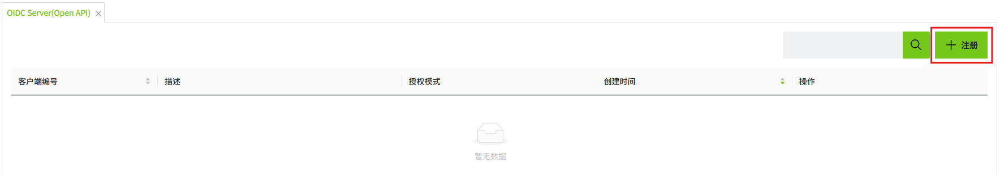
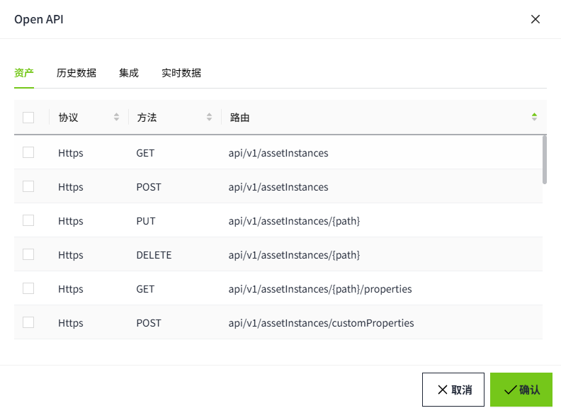

# 获取access_token

在测试 Open API 之前，我们应该先获取访问令牌（access token）

1. 登录 VC Hub，进入 API 凭据管理页面，并创建一对新的客户端 ID 和客户端密钥（client ID 和 client secret）。关于API授权管理可以参考 [OpenID Connect客户端](../../security/open-api.md)

    
    
    

2. 点击 **API权限** 按钮并给新创建的客户端ID附上所有的权限。

    

    

3. 打开 Postman 应用程序，点击菜单创建一个 HTTP 请求，如下图所示。

    

4. 创建一个针对 URL `https://localhost:8043/.well-known/openid-configuration` 的 GET 请求。点击“**Send**”按钮发送请求，并从响应中提取 **Token URL**。请注意，Open API 仅支持 HTTPS 协议。HTTPS 的默认端口是 8043，可以在节点设置页面进行配置。关于 **节点配置**，可以参考 [节点配置](../../node-configuration.md) 

    

5. 使用上一步中获取的令牌 URL 创建一个 POST 请求。  

    

6. 输入在 API 凭据页面注册的客户端 ID 和客户端密钥，如下例所示。将 grant_type 设置为 "client_credentials"，然后点击“Send”按钮。访问令牌（access token）可以从 HTTP 响应中提取。请注意，请求体格式必须为 **x-www-form-urlencoded**。

    

| 参数名  | 描述|
|:------------|:---------------------------------|
| client_id   | 在 API 凭证管理页面注册的客户端 ID |
| client_secret | 在 API 凭证管理页面注册的客户端密钥|
| grant_type   |OpenID 请求的授权类型。仅支持 "client_credentials" 这一个值|

