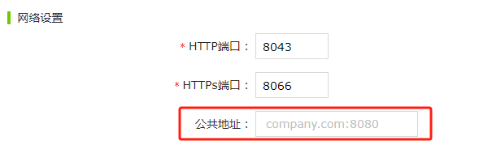

# 运行画面主备自动切换

WAGO VC Hub在配置冗余节点后，如果有浏览器打开了组态画面，组态画面会检查当前节点的运行状态以及冗余节点的运行状态，并且会向两个节点发行心跳包。如果当前节点的运行状态是Standby且冗余节点的运行状态是Running, 此时当前运行画面就会触发主备切换，实时画面的地址会自动切换到冗余节点的地址。

以下是会触发画面主备切换的场景。

| **当前节点类型** | **主节点状态**        | **备节点状态**        | **触发画面切换** |
|:------------------|:-----------------------|:-----------------------|:------------------|
| 主节点           | Standby或者心跳无响应 | Running且心跳正常响应 | 是               |
| 主节点           | Running且心跳正常响应 | Standby或者心跳无响应 | 否               |
| 备节点           | Standby或者心跳无响应 | Running且心跳正常响应 | 否               |
| 备节点           | Running且心跳正常响应 | Standby或者心跳无响应 | 是               |

#### 画面主备切换地址配置

实时画面发生主备切换时会优先使用冗余节点的公共地址进行跳转。公共地址可以在“网络"->“节点配置”页面的公共地址上进行配置。

若配置了公共地址，主备切换时会优先使用公共地址进行跳转。如果没有配置公共地址，则会使用冗余配置中的主节点地址或者冗余的连接的远程IP地址进行跳转。

#### 主备切换场景

**场景一** ：未配置公共地址，主备切换时，使用当前运行服务器的地址作为切换后的网址。

1. 服务器A作为主服务器，地址为`http://pc-test-serverA:8060`
2. 服务器B作为主服务器，地址为`http://pc-test-serverB:8060`
3. 服务器A和服务器B形成冗余
4. 服务器A上查看VC Hub的运行画面，此时服务器A宕机，服务器B运行，运行画面的地址显示为`http://pc-test-serverB:8060`

**场景二** ：配置了公共地址，主备切换时，使用当前运行节点所设置的公共地址作为切换后的网址。

1. 服务器A作为主服务器，地址为`http://pc-test-serverA:8060`
2. 服务器B作为主服务器，地址为`http://pc-test-serverB:8060`
3. 服务器A和服务器B形成冗余
4. 服务器A和服务器B的公共地址设置为`https://testserver.com:8066`
5. 服务器A上查看VC Hub的运行画面，此时服务器A宕机，服务器B运行，运行画面的地址显示为`https://testserver.com:8066`

