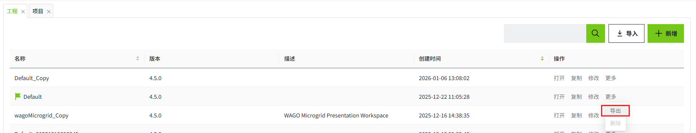
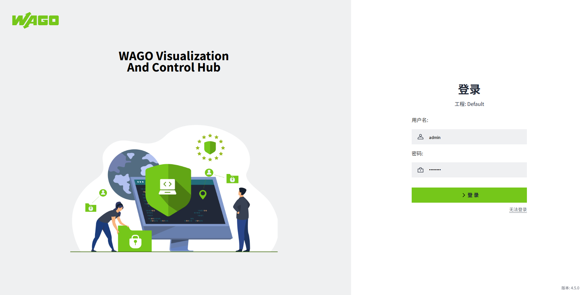

# 冗余配置同步

两个VC Hub节点配置冗余之前需要确保两个节点上有工程数据，组网配置以及节点名称需要保持一致。我们可以在主节点的工程管理页面将工程导出然后导入到备节点上。

您可以为导出的文件设置密码。

然后在备节点的工程页面，点击”**导入**“按钮，将从主节点导出的文件导入，导入时会提示是否覆盖节点配置，冗余和组网信息。

此处建议选择”覆盖“，确保主备的配置一致。

覆盖操作完成后，会进入启动页面。

启动完成后，进入登录页面，使用主节点下的用户名进行登录。登录后，您会发现备节点上的所有数据和配置和主节点保持一致。

