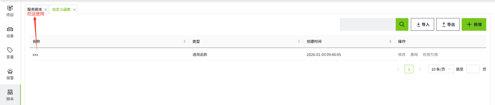
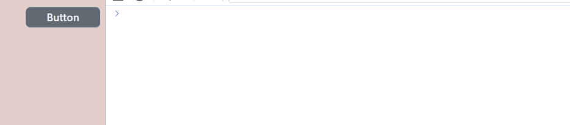

# 自定义函数

自定义函数指用户自行编写的函数，可以在其它脚本中对其进行调用。使用自定义函数可以减少重复代码，从而降低应用程序的维护工作量。其自身不能直接被系统触发调用，必须通过其他脚本来调用执行，自定义函数分为两种类型：**通用函数**和**服务函数**。

**通用函数**： 通用函数适用于服务脚本和控件脚本，具有通用性，在脚本中使用userDefined命名空间来获取创建好的自定义函数。

**服务脚本**：服务脚本仅用于服务脚本，在脚本中使用userDefined命名空间来获取创建好的自定义函数。



**说明**：  
1. 自定义函数有且仅有一个export function，export function的名称即自定义函数的名称。
2. 对于自定义函数，函数间的名称必须唯一。
3. 如有需要也可以定义非export函数，但是其无法被外部脚本调用。 
4. 列表中显示的名称为export函数的名称。 

在”**脚本**“->”**自定义函数**“页面，点击列表右上角的“**新增**”按钮进行创建。


**示例**

1. 创建一个自定义函数，名称为：getTagValue。脚本如下：

```typescript
export async function getTagValue() {
  const data = await System.Tag.read('@设备:温度')
  console.log(data)
  console.log(data.value)
}
```
 
2. 在画面上绘制一个按钮控件，在控件的鼠标按下动作中，编写如下脚本：

```typescript
userDefined.getTagValue()
```
 
3. 点击画面的”预览“按钮，在运行画面按下按钮时就会执行这段脚本，然后在控制台打印出查找变量的value。



