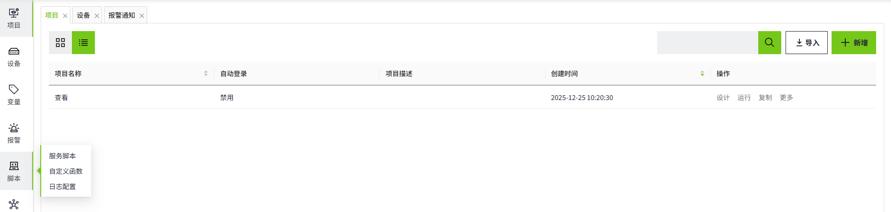

# 脚本

## 什么是脚本？

大多数时候，当我们在WAGO VC Hub中谈论“脚本”时，我们主要指的是JavaScript（JS）脚本。JavaScript（简称“JS”）是一种具有函数优先的轻量级，解释型或即时编译型的编程语言。虽然它是作为开发Web页面的脚本语言而出名，但是它也被用到了很多非浏览器环境中，JavaScript基于原型编程、多范式的动态脚本语言，并且支持面向对象、命令式、声明式、函数式编程范式。

在WAGO VC Hub中，您将把核心JS 语言与对其他组件和各种内置系统函数的引用混合在一起。

您可以在“**脚本**”菜单下，创建各种类型的脚本。

## 脚本的安全性

在WAGO VC Hub中，脚本是一种高级功能，可以为复杂的组态场景提供最大的灵活性和便利性，比如需要进行复杂的逻辑运算或者操作本地资源（读写文件等）。正是其这种开放的能力，导致其可能存在一定的安全风险，比如组态工程师不小心编写了一段恶意代码。但不管如何，能在WAGO VC Hub中编写脚本的一定是WAGO VC Hub的合法用户，所以您可以认为WAGO VC Hub仅提供了一个脚本编程工具，而是否会编写出恶意代码，取决于编写代码的人，WAGO VC Hub自身不会对脚本内容进行管控。

脚本功能允许用户自定义逻辑、数据处理、事件响应和界面交互，极大提升了系统的灵活性和自动化能力。但若管理不当，也可能带来严重的安全和运行风险，所以我们建议：

1. 仅授权可信用户编辑脚本权限（可通过角色权限控制）
2. 部署前必须审查脚本内容，防止恶意或错误代码
3. 不要向访客或低权限账户开放脚本编辑权限
4. 建立审查和修改批准流程，定期审计脚本是否被修改
5. 尽可能先在测试环境验证脚本行为
6. 结合AI工具辅助判断是否存在安全风险

## 它易于使用吗？

幸运的是，JS 是一种简单的入门语言。我们在 WAGO VC Hub中提供了大量函数，可以在一行代码中完成一些常见任务。这些系统功能在键入时可用。只需从“System”开始，然后按“.”即可查看可用功能列表。当您继续键入时，该列表将自行过滤。

## 脚本在哪里使用？

JS 在WAGO VC Hub的许多地方都有使用。每个位置都有自己的事件，这些事件会触发脚本运行，并以不同的方式向项目添加功能。

以下是常用的使用场景：

- **控件**：向按钮等控件添加动作，自定义图表和表格的外观，甚至设置自定义导航架构。
- **生命周期**：在控件或者画面加载/卸载的时候触发脚本运行。
- **时间表**：定时执行脚本。
- **自定义函数**：允许用户自己定义函数，来在脚本中快捷选择函数来使用。
- **表达式函数**：表达式函数是预定义的函数，可以在项目中的多个位置调用。执行表达式函数时，可以传递参数来获取执行结果，这有助于避免重复编写相同的逻辑。

- **页面函数**：页面函数是预定义的函数，可以在项目中的多个位置调用。执行页面函数时，可以传递参数来获取执行结果，这有助于避免重复编写相同的逻辑。

