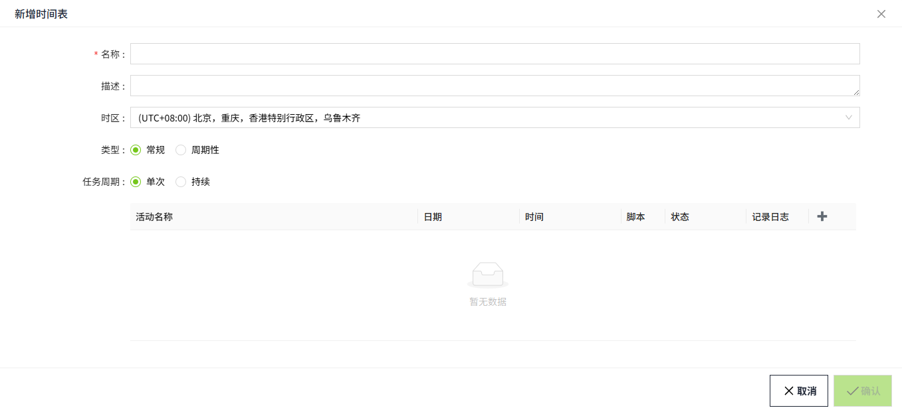

# Schedule

The schedule is a tool used in the system to manage and schedule script execution. The schedule allows you to view the last execution time and execution result of multiple scripts. In the schedule list, the execution time and execution result of the most recent script are displayed on the right page. Users can manipulate the schedule by using the Add, Modify, and Delete buttons, and edit the specific information of the schedule in the Add and Modify windows. In addition, users can view logs and schedules, and the View Schedules page gives them the option to view all the schedules created in the system and display their activity schedules on the calendar control.

 

## **To add a new schedule**

1. On the "**Scripts**"->"**Service Script**" page, click the Schedule tab, and then click the Add button at the top right corner of the list to create a schedule. 
    

| **Name**             | **Description**                                                                                                                                                                                                                                                                                                                                                                                                                             |
|----------------------|---------------------------------------------------------------------------------------------------------------------------------------------------------------------------------------------------------------------------------------------------------------------------------------------------------------------------------------------------------------------------------------------------------------------------------------------|
| Name                 | Schedule name                                                                                                                                                                                                                                                                                                                                                                                                                               |
| Description          | Description information of the schedule                                                                                                                                                                                                                                                                                                                                                                                                     |
| Timezone             | The time zone in which the schedule will be executed.                                                                                                                                                                                                                                                                                                                                                                                       |
| Type                 | The schedule is divided into regular and periodic.                                                                                                                                                                                                                                                                                                                                                                                          |
| Recurrence Pattern   | Sets the execution period of the schedule. The period options vary depending on the type selected.                                                                                                                                                                                                                                                                                                                                          |
| Effective Time Range | Configure the time period during which the schedule is valid.  If a time range is specified, the schedule will only be executed within that period.  - The **start time** and **end time** are both empty by default. - If the **start time** is empty, the schedule will be triggered immediately once the trigger conditions are met. - If the **end time** is empty, the schedule remains permanently effective with no expiration date. |

2.Click ➕ to add a specific activity. 

3.When the setting is completed, click the **"OK"** button to save. The data is displayed in the schedule list.

**Viewing the schedule**

Click the "View Schedule" button of the timesheet to view the execution plan and results of the timesheet. 

There are three execution status for an activity.

   - Success
   - Failed
   - Not executed

Activities can be visually distinguished by their color.

For successful activities, the background color is **green**;

For successful activities, the background color is **red** ;

For activities that were not executed, the background color is **purple**;

