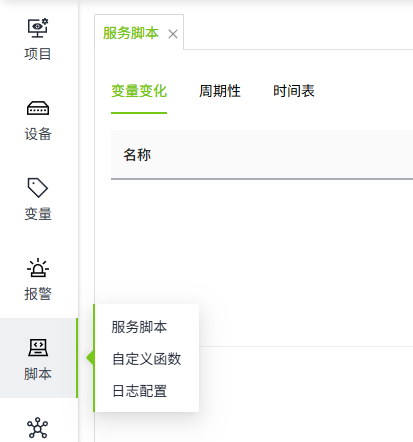
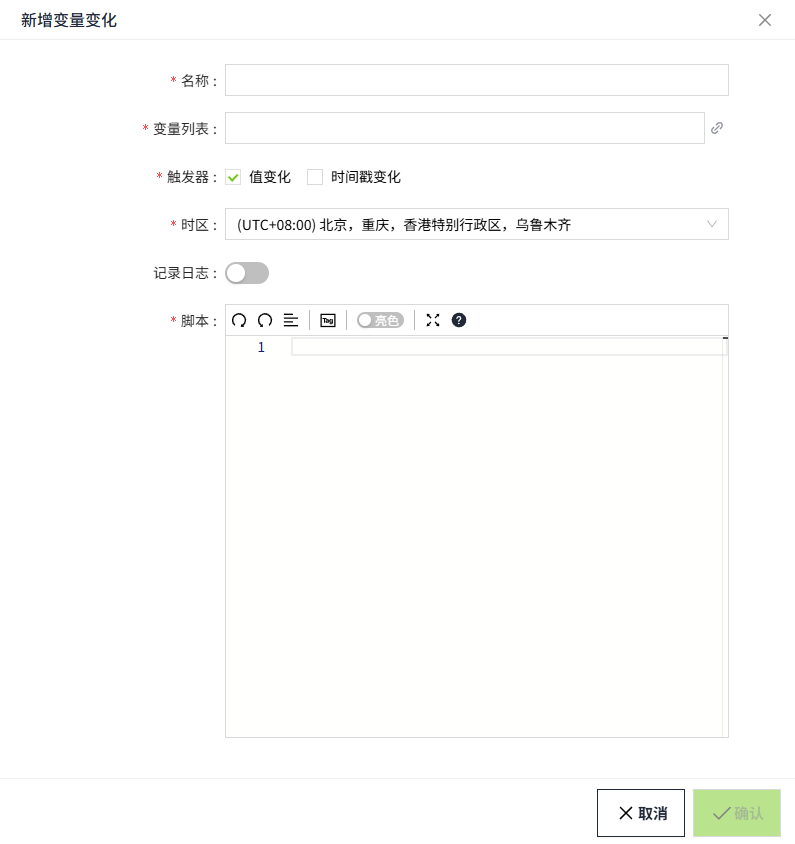
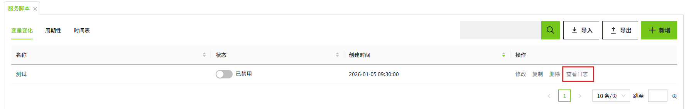
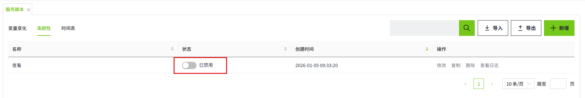
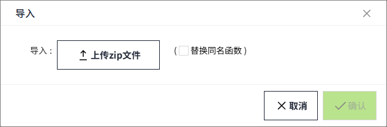
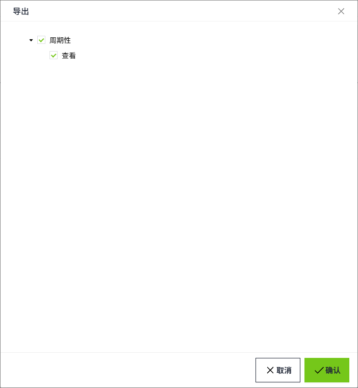

# Service Script

A service script is a script that runs on a server and is usually designed to perform a specific task or maintenance operation to ensure the proper functioning of the system. 

These scripts can be categorized into three types based on how they are executed and for what purpose: 

1. Tag Changed
2. Periodical
3. Schedule

## Add Scripts

#### **Tag Changed**

Tag changed are scripts that are executed when the conditions selected in a trigger change.

On the "**Scripts**" -> "**Service Script**" screen, click the "**Tag Changed**" tab, and then click the "Add" button at the upper-right corner of the list to create the script.

| **Property** | **Description**                                                                                                                                                                                                                                                           |
|--------------|---------------------------------------------------------------------------------------------------------------------------------------------------------------------------------------------------------------------------------------------------------------------------|
| Name         | The name of the script.                                                                                                                                                                                                                                                   |
| Tag List     | The tag to be bound.                                                                                                                                                                                                                                                      |
| Trigger      | Used to set what conditions trigger this script to contain:   - **Value Changed**: the script will be triggered when the value of any tag in the tag list changes.  - **Timestamp Changed**: The script is triggered when the timestamp of any tag in the tag list changes. |
| Timezone     | Sets the time zone according to which the script is executed.                                                                                                                                                                                                             |
| Record Log   | Whether to record script logs.                                                                                                                                                                                                                                            |
| Script       | Write a script to be executed.                                                                                                                                                                                                                                            |

New scripts are disabled by default, you need to enable them manually to execute the scripts.

If "Record Log" is enabled, click the "View Log" button of the script to display the detailed log information. 

#### **Periodical**

Periodical scripts are scripts that are triggered at a set frequency and executed on the server backend.

On the "**Scripts**" -> "**Service Script**" page, click the "Periodical" tab, and then click the "Add" button on the upper right corner of the list. 

| **Attribute**  | **Description**                                               |
|----------------|---------------------------------------------------------------|
| Name           | The name of the script.                                       |
| Frequency (ms) | How often the script is executed.                             |
| Timezone       | Sets the time zone according to which the script is executed. |
| Record Log     | Whether to record script logs.                                |
| Script         | Write the script to be executed.                              |

The default state of the periodic script is "disabled", you need to enable it manually, and the script will be executed normally after it is enabled. 

If Record Log is enabled, you can view the execution log of the periodic script by clicking View Log. 

#### **Schedule**

See [Schedule](schedule.md) for details.

#### Import/Export Scripts

Click the export button in the upper right corner of the list to open the export window, where you can select the scripts to be exported.

Click the import button to import the previously exported file again.

