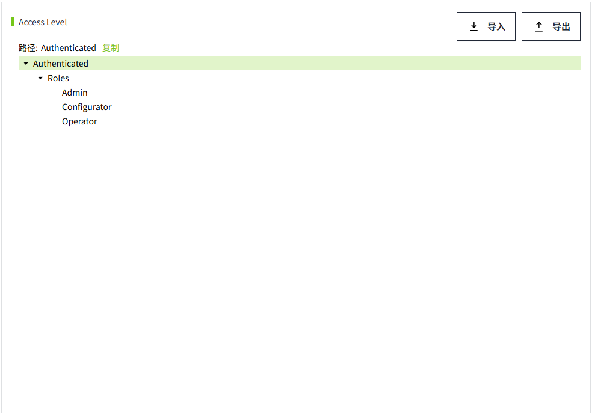
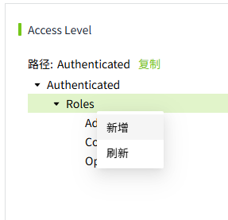
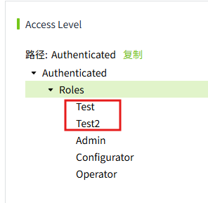
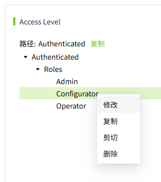
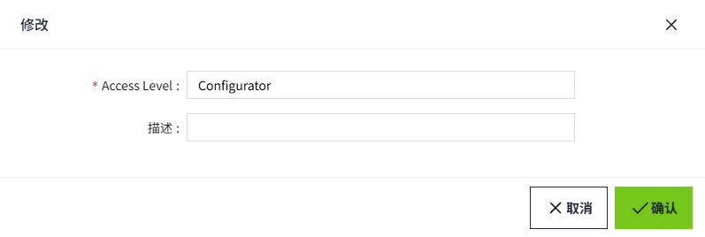
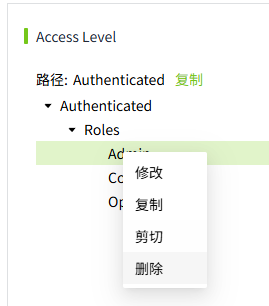
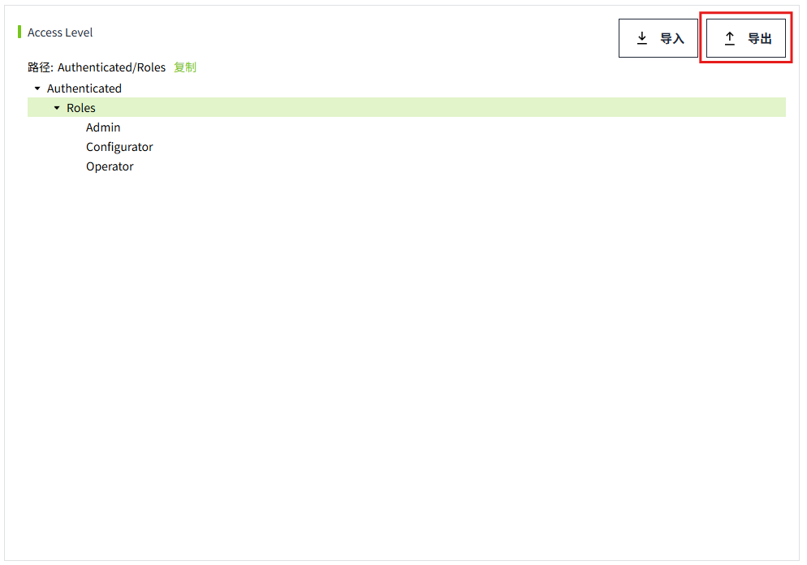

# Access Level

用于维护管理平台的Access Level。点击菜单栏“权限”->“Access Level”，可进入Access Level配置页。用户可根据需要灵活配置Access Level。

通过分配不同的Access Level级别，能够精确的控制用户是否有权访问特定的资源。

**注意：** 在Access Level中添加或删除的角色不会影响 “角色” 列表中的角色数据，它们彼此相互独立。 

Access Level在系统中以树状结构展示。默认预留了五个级别。

- Authenticated
- Authenticated/Roles 
- Authenticated/Roles/Admin
- Authenticated/Roles/Configurator
- Authenticated/Roles/Operator

| **级别**                         | **说明**|
|:----------------------------------|:-------------------------------------------------------------------------------------------------------------------------------------------------------------------------------|
| Authenticated                    | 登录成功的用户，默认都拥有"Authenticated"级别。|
| Authenticated/Roles              | 可以在该级别下添加子级别，但只能添加一级子级别。“Authenticated/Roles”级别外的级别，可以根据您的需求进行任意深度的嵌套。这些级别应与预期从Identity Provider处获得的角色名称相对应。 |
| Authenticated/Roles/Admin        | 系统内置角色。|
| Authenticated/Roles/Configurator | 系统内置角色。 |
| Authenticated/Roles/Operator     | 系统内置角色。|

## 自定义Access Level

支持用户根据需要对Access Level进行新增修改删除操作。

**注意：**  
1. 点击保存按钮后，Access Level才会真正保存。 
2. 点击取消按钮，将恢复至上一次的保存内容。

## 新增Access Level

支持用户创建自己的Access Level。

1. 右键点击需要新增Access Level的父级别，打开下拉菜单。

    

2. 点击“新增”按钮，打开新增弹窗。
3. 输入新增Access Level的名称和描述。

    

4. 点击弹窗“确认”按钮，新级别将插入到当前所选级别下的第一级。
5. 点击页面的“保存”按钮，保存修改的内容。

**注意：**  
1. 新增Access Level时，如果同一级别已存在同名的Access Level(不区分大小写)，新增操作将会失败。 

2. 不同级别可以同名。 

3. Authenticated/Roles级别仅支持一级子级别，“Authenticated/Roles”级别外的级别，可以根据您的需求添加任意多层级的子级。

## 刷新Access Level

仅Authenticated/Roles级别上支持刷新操作，这将把Local类型的Identity Provider的角色列表同步到此处。

用户在该级别下已添加的内容不会受到刷新的影响。

1. 右键点击Authenticated/Roles级别，打开下拉菜单。

    

2. 点击“刷新“按钮，将自动同步角色列表下的所有角色。

    

3. 点击页面的保存按钮，Access Level将会被保存。

**注意：**  
1. 仅“Authenticated/Roles”支持刷新。 
2. 刷新后，如果同级别下存在同名角色，则会保留已存在的角色。

## 修改Access Level

支持对已有的Access Level进行修改。

1. 右键点击需要修改的Access Level，打开下拉菜单。

    

2. 点击修改按钮，打开修改弹窗。

    

3. 修改Access Level或描述。
4. 点击弹窗"确认"按钮，保存修改的内容。
5. 点击页面的保存按钮，对access level树进行保存。

**注意：** “**Authenticated**”和“**Authenticated/Roles**”不支持修改。

## 删除Access Level

支持对已有的Access Level进行删除操作。

1. 右键点击需要删除的Access Level，打开下拉菜单。

    

2. 点击“删除”按钮，进行删除。

**注意：**  
1. “Authenticated”和“Authenticated/Roles”不支持删除。 
2. 删除后，当前级别及其所有子级别，将一同被删除。

## 复制Access Level

支持对已有的Access Level进行复制操作。

1. 右键点击需要复制的Access Level，打开下拉菜单。
2. 点击“复制”按钮，Access Level复制成功。（当前Access Level及其子级别，将一同被复制。）

    

3. 右键点击需要粘贴的Access Level，在右键菜单中点击“粘贴”按钮，被复制的Access Level及其子级别，将被复制到当前所选的Access level下。
4. 点击页面的“保存”按钮，Access Level将被保存。

**注意：**  
1. “Authenticated”和“Authenticated/Roles”不支持复制 
2. “Authenticated/Roles”仅支持一级子级别，所以“Authenticated/Roles”下的子级别不支持粘贴操作。

## 剪切Access Level

支持对已有的Access Level进行剪切操作。

1. 右键点击需要剪切的Access Level，打开下拉菜单。
2. 点击“剪切”按钮，Access Level剪切成功。（当前Access Level及其子级别，将一同被剪切。）

    

3. 右键点击需要粘贴的Access Level，在右键菜单中点击“粘贴”按钮，被剪切的Access Level及其子级别，将被剪切到当前所选的Access level下。

    

4. 点击页面的“保存”按钮，Access Level将被保存。

**注意：**  
1. “Authenticated”和“Authenticated/Roles”不支持剪切。 
2. “Authenticated/Roles”仅支持一级子级别，所以“Authenticated/Roles”下的子级别不支持粘贴操作。

## 快捷复制

为了避免手动输入错误，我们支持在Access Level页面快捷复制Access level路径，以便在需要的地方进行粘贴。

## 导出Access Level配置

1. 点击“导出”按钮，将数据导出。

    

## 导入Access Level配置

1. 点击“导入”按钮，将导出的数据进行导入。

    

2. 导入完成后点击页面的“保存”按钮，保存导入的内容。