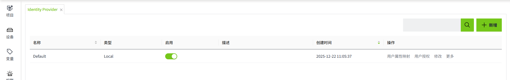
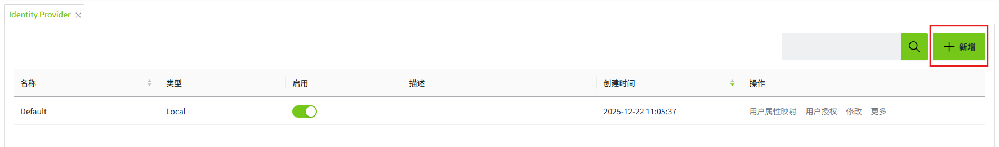
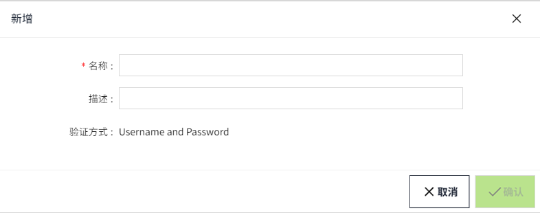
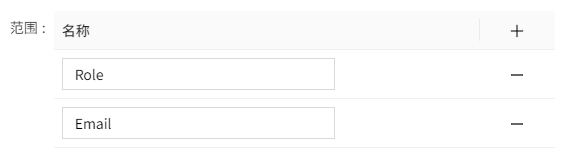

# Identity Provider

**Identity Provider** 为用户提供了一种使用存储在 **WAGO VC Hub** 外部的凭证登录 **WAGO VC Hub** 的方法。支持 **单点登录(SSO)**。

WAGO VC Hub可以连接到以下2种不同类型的Identity Provider：

- **Local -** WAGO VC Hub的内部Identity Provider
- **OpenID Connect -** 基于 OpenID Connect 协议的外部身份验证提供程序。

WAGO VC Hub安装成功后，在 **Identity Provider列表** 中会显示内置的一条Identity Provider。

**说明**：只允许存在 **1个** 类型为 **Local** 的Identity Provider。

## 新增Local类型的Identity Provider

当启用 **Local** 类型的Identity Provider时，使用在系统内创建的用户进行登录。

**前提：** 当前不存在Local类型的Identity Provider。

1. 在 **"权限"->"Identity Provider"** 列表的右上角，点击“**新增**”按钮。

    

2. 在 **Identity Provider** 弹窗中，选择 **Local**，点击“**下一步**”。

    

3. 在 **新增** 弹窗中填写名称后，点击“**确认**”按钮，完成新增操作。

    

## 新增OpenID Connect类型的Identity Provider

允许创建多个OpenID Connect类型的Identity Provider。

1. 在 **"权限"->"Identity Provider"** 列表的右上角，点击“**新增**”按钮。

2. 在 **Identity Provider** 弹窗中，选择 **OpenID Connect**，点击“**下一步**”。

    

3. 在 **新增** 弹窗中设置完成后，点击“**确认**”按钮，完成新增操作。

    

**属性**

| **名称**   | **描述**|
|:------------|:-------------------------------------------------------------------------------------------------------------------------------------------------------------------------------------------------------------------------------------------------------------------------------------------------------------------------------------------------|
| 名称       | Identity Provider的名称。|
| 描述       | Identity Provider的描述。|
| URL        | OpenID Provider配置文件的URL。|
| 重定向URL  | OpenID Connect 认证成功或失败后，Identity Provider将用户的浏览器重定向到WAGO VC Hub的 URL。|
| 客户端编号 | Identity Provider分配给每个OpenID Connect客户端应用的唯一标识符。|
| 客户端密钥 | 用于验证 OpenID Connect客户端身份的私密凭据，相当于“密码”。 |
| 范围       | 通过范围，WAGO VC Hub告诉Identity Provider它需要访问哪些用户信息。   例如：    这表示WAGO VC Hub请求访问用户的 **角色** 和 **电子邮件地址** 。 |

## 注意事项

根据OpenID Connect (OIDC) 协议，若在WAGO VC Hub中集成第三方Identity Provider（如Auth0），需在第三方平台配置WAGO VC Hub的登录回调地址（Redirect URI）和登出回调地址（Post Logout Redirect URI）。

当工程文件从原服务器导出并导入至新服务器时，由于新服务器的地址未在第三方Identity Provider中注册，OIDC校验将失败，导致用户无法登录。因此，**迁移工程后，必须在第三方平台（如Auth0管理界面）将新服务器的回调地址追加至原有配置中**。

**以Auth0为例的操作方法：**
在Auth0应用的 **Allowed Callback URLs** 和 **Allowed Logout URLs** 字段中，将新服务器地址以逗号分隔的形式添加到原有地址后方.

例如：

