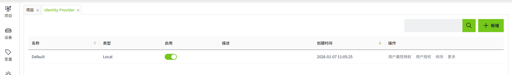

# 登录测试

配置完Identity Provider后，可以通过 **登录测试**，测试该Identity Provider下的用户是否可以成功登录系统。

## 登录测试

1. 点击“Security”->“Identity Provider”菜单。

    

2. 在Identity Provider列表的操作栏中，点击某一条数据的“**登录测试**”。

    

3. 会在浏览器的新窗口打开登录界面。
4. 使用当前所选的Identity Provider的用户名和密码进行登录。
5. 如果登录成功，您将返回到Identity Provider的登录测试页面，并显示返回结果。

    

## 登出测试

测试登录后，您不希望始终保持登录状态。您可以使用测试登出功能进行注销。

点击“**测试登出**”按钮后，当前页面会显示Identity Provider列表。

