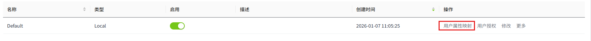

# 用户属性映射

用户属性映射允许您将Identity Provider响应文档中的信息映射到易于理解的属性。要正常工作，这要求WAGO VC Hub已经具有有效的Identity Provider配置，该配置在尝试登录时返回响应文档。

## 配置用户属性映射

1. 点击“**Security**”->“**Identity Provider**”菜单。

   

2. 在Identity Provider列表的操作栏中，点击某一条数据的“用户属性映射”。

   

3. 在弹窗中设置映射来源和路径。系统内置了如下5个可用于映射的属性。

   

**属性**

| **名称** | **描述**|
|:----------|:--------------------------------------------------------------------------------------------------------------------------------------------------------------------------------------------------------------------------------------------------------------------------------------|
| 用户     | 用于用户名的映射|
| 角色     | 用于角色的映射|
| 姓名     | 用于姓名的映射|
| 邮箱     | 用于邮箱的映射 |
| 电话     | 用于电话的映射|
| 来源     | 该映射包含以下内容：   - **ID Token Claims**：ID 令牌声明，用于表示用户的身份信息。  - **Token Endpoint Response**：令牌端点响应。通常包含 Access Token、ID Token 和 Refresh Token,这些令牌用于对用户进行身份验证与权限授权。  - **User Info Claims**：用户信息声明。包含用户的详细属性（如姓名、邮箱、头像等）,这些信息通常由身份提供方在查询用户信息端点时返回。 |
| 映射路径 | 通常用于将Identity Provider返回的用户信息映射到本地系统的用户模型，确保应用程序能够正确识别和授权用户。|

4. 点击“**确认**”按钮，完成设置。

**示例**

1. 假定 **Identity Provider** 返回的 **ID Token** 包含如下信息：

{

  "username": "alex",

  "email": `alex@example.com`,

  "user_roles": "admin"

  "name": "张三"

}

2. 映射路径可以设置为：

 

 - `username` → 本地用户名（username）
 - `email` → 本地用户邮箱（email）
 - `user_roles` → 本地用户角色（role）
 - `name` → 本地用户姓名（name）

3. 在WAGO VC Hub中，最终用户信息被映射为：

{

  "username": "alex",

  "email": `alex@example.com`,

  "role": "admin"

  "name": "张三"

}