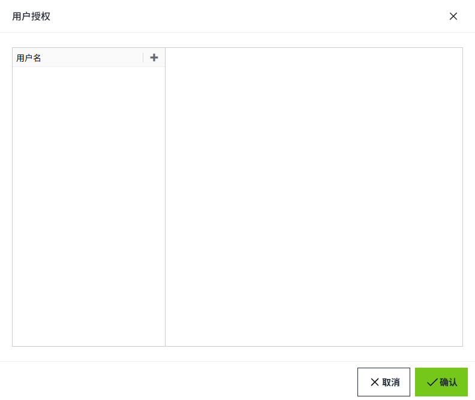

# 用户授权

用户授权是一种直接将用户分配到Access Level的方法。用户授权实质上是对安全级别原始规则的覆盖。

可以通过 **权限- > Identity Provider** 列表的 **用户授权** 按钮，对用户进行授权。可以添加用户，以便随后向他们授予 Security Levels。

**注意：** 在用户授权中添加和删除用户时，并不会对Identity Provider内的用户产生影响。

通过用户名，为这些用户分配任意数量的Access Levels。选择一个级别将自动选择其上方的所有级别。

用户授权只能在用户使用Identity Provider进行身份验证后应用于用户。

**注意：** 系统无法根据Identity Provider 中的实际用户验证此处创建的任何用户。相反，**用户名** 需要 **准确** 输入，包括区分大小写，当用户登录时，系统将检查他们是否与任何配置的用户名匹配，以授予用户授权。

## 配置用户授权

配置用户授权分为两部分：添加用户, 为用户分配Access Level。

1. 点击“**Security**”->“**Identity Provider**”菜单。

    

2. 在Identity Provider列表的操作栏中，点击某一条数据的“用户授权“。

    

3. 在弹窗中，点击添加按钮，添加用户名。

    

4. 选择用户，为右侧页面为该用户设置access level。当前选中的用户会处于高亮状态。

    

5. 为一个用户设置完access level后，继续选择下一个用户进行access level的设置。所有用户全部设置完成后，点击”确认“按钮，进行整体保存。

