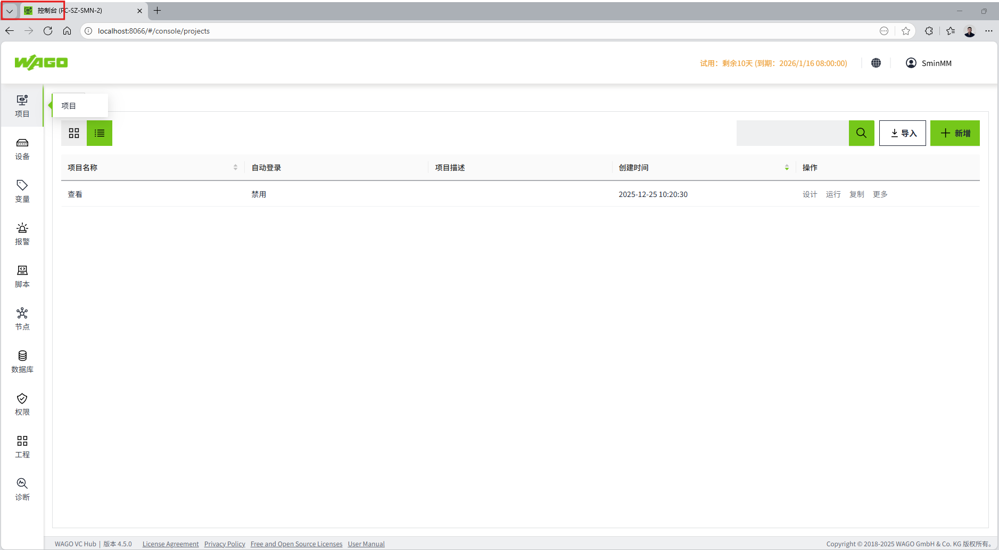
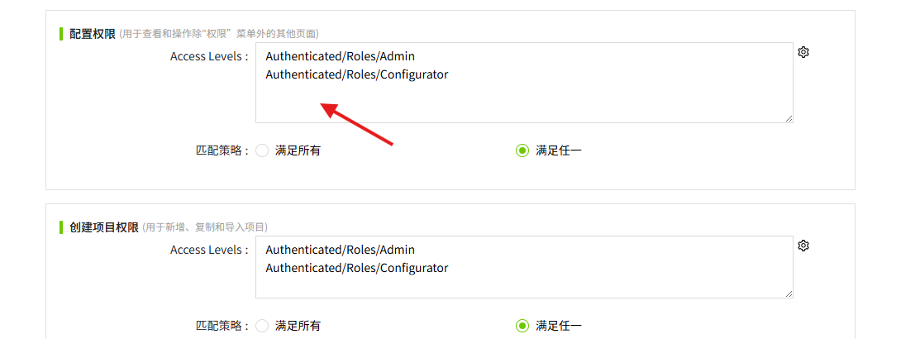
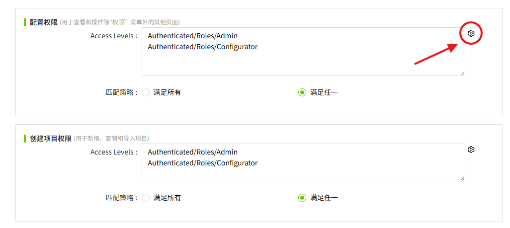
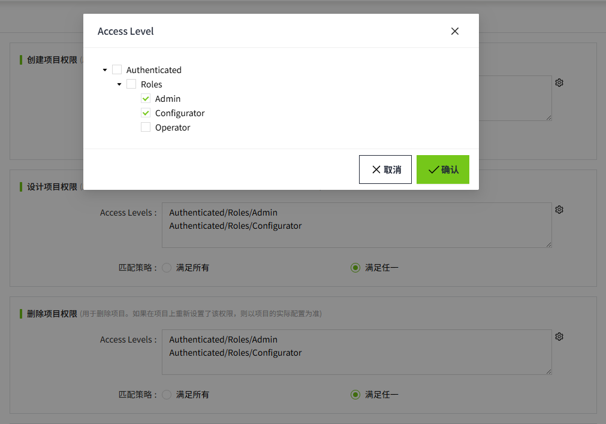

# Permission

用于对管理平台的操作和项目的新增进行权限控制。点击菜单栏“权限”->“Permission”，可进入权限配置页。用户可根据需要灵活配置权限。

包含6个类别：

1. **创建项目权限**
2. **设计项目权限**
3. **删除项目权限**
4. **配置权限**
5. **查看权限**
6. **安全权限**

| **类别**     | **说明** | **默认权限**                                                |
|:--------------|:--------------------------------------------------------------------------------------------------------------------------------------------------------------------------------------------------------------------------------------------------------------------------------------------------------|-------------------------------------------------------------|
| 创建项目权限 | 用于 **新增、复制** 和 **导入** 项目。   | Authenticated/Roles/Admin  Authenticated/Roles/Configurator |
| 设计项目权限 | 创建项目后，可以设计项目的初始权限。如果后续在项目上重新设置了该权限，则以项目的实际配置为准。   | Authenticated/Roles/Admin  Authenticated/Roles/Configurator |
| 删除项目权限 | 创建项目后，可以删除项目的初始权限。如果后续在项目上重新设置了该权限，则以项目的实际配置为准。   | Authenticated/Roles/Admin  Authenticated/Roles/Configurator |
| 配置权限     | 用于管理平台的权限控制。用于 **查看** 和 **操作** 除“权限”菜单外的其他页面。| Authenticated/Roles/Admin  Authenticated/Roles/Configurator |
| 查看权限     | 用于管理平台的权限控制。用于 **查看** 除“权限”菜单外的其他页面。 | Authenticated/Roles/Operator                                |
| 安全权限     | 用于管理平台的权限控制。用于 **查看和操作** “权限”菜单相关页面。| Authenticated/Roles/Admin                                   |

**说明**： 

1. 以上默认权限中的 **Admin, Configurator, Operator** 为系统 **内置角色**。 

2. 以下页面称之为 **管理平台**。  
 

#### 配置权限

1. **配置Access Level**

    **方式一**：在Access Level文本框中手动输入路径。

    

    为了避免手动输入错误，您可前往Access Level页面，复制路径后，在Permission页面进行粘贴。

    

    **方式二**：点击Access Level输入框右侧的设置按钮。

    

    在弹出的Access Level弹窗中，选择需要的权限。

    

    **说明：Access Level中的每个节点均可独立选择。**

    例如下图所示

    

    点击确认按钮后，会在Permission页面对应类别的Access Level文本框中显示以下路径：

    

    **说明：** 如果将Access Level文本框的内容全部删除后，会自动填充 **Authenticated**。这意味着任何成功登录的用户，都将拥有该项权限。 

2. **设置匹配策略**

    匹配策略默认选择“满足任一”, 用户可根据实际情况进行调整，仅支持选择一种匹配策略。

    | **匹配策略** | **说明**                                                   |
    |:--------------|:------------------------------------------------------------|
    | 满足所有     | 用户必须拥有所有授权级别，才能拥有相应权限。                 |
    | 满足任一     | 用户拥有所设的access level中任一授权级别，即可拥有相应权限。 |

3. **点击“确认“按钮，进行保存。**

