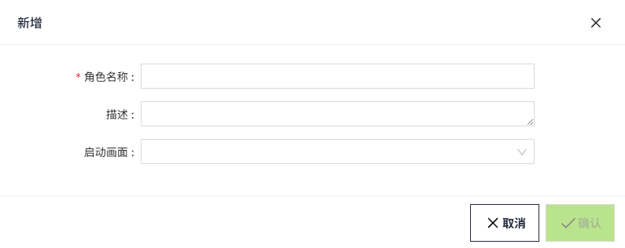
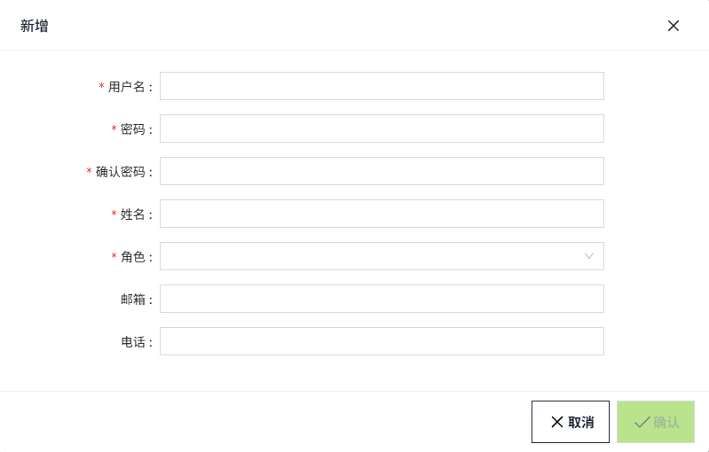

# 角色和用户

WAGO VC Hub提供3个内置的角色。

- Admin：具有所有权限。  
- Configurator：和Admin唯一的区别是，在创建用户时，角色不能选择Admin。  
- Operator：只能查看项目的运行画面以及查看设备。

### 创建角色

您可以在角色页面添加其他角色。

1. 在菜单中点击“权限”>“角色”。
2. 在角色列表页面点击新增按钮，创建角色。

**属性**

| **名称** | **描述** |
|:----------|:-------------------------------------------------------------------------------------------------------------|
| 名字角色 | 此角色的名称。 |
| 启动画面 | 当某个角色只能查看特定项目的运行画面时，可以为该角色配置启动画面。从所有的项目画面中选择一个画面作为启动画面。 |

### 创建用户

首次登录后，在用户列表中会显示安装时创建的首个用户。可以在用户页面添加其他用户。

1. 点击“权限”>“用户”。
2. 在用户列表页面点击新增按钮，创建用户。 用户仅支持设置一个角色。 

    

