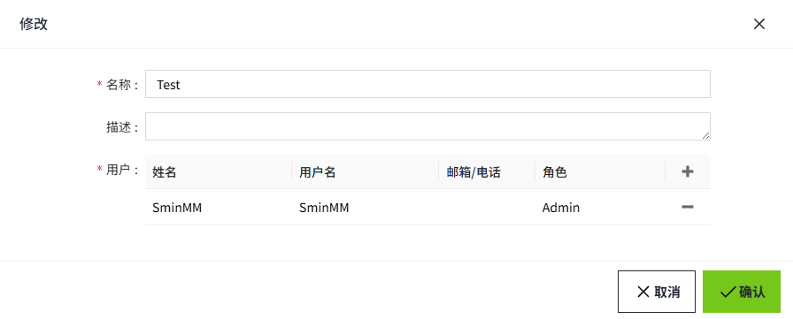
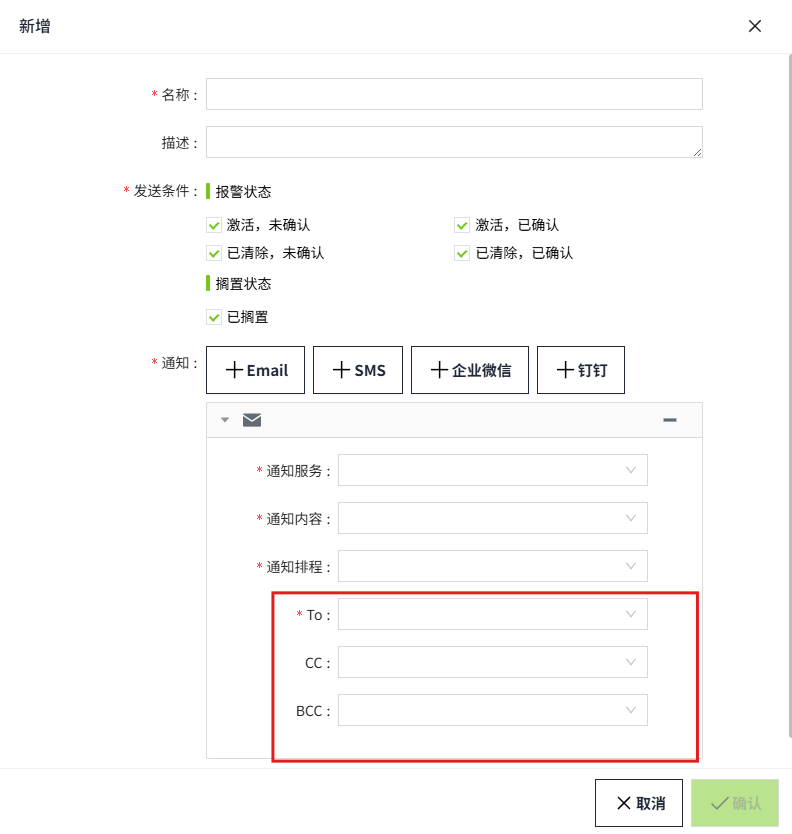
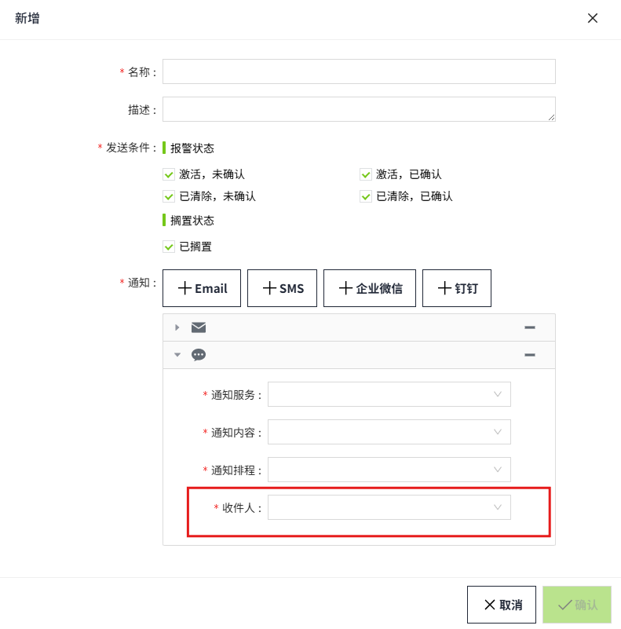

# 用户组

用于对接收报警通知的用户进行分组，每个组内含有特定的用户。当发生报警时，按照[通知规则](../alarming/alarm-notification/rules.md)，给对应的用户发送报警通知。

## 创建和管理用户组

#### 新增

1. 在“权限”->"用户组"页面，点击“新增”按钮创建用户组。

    

2. 在新增弹窗，设置用户组的名称，点击“新增”按钮为该用户组添加用户。

    

    | **配置** | **描述**                                           |
    |:----------|:----------------------------------------------------|
    | 名称     | 用户组的名称，名称不可重复，必填项。                  |
    | 描述     | 用户组描述信息，可选填。                             |
    | 用户     | 设置属于该用户组的用户。一个用户可以属于多个用户组。 |

3. 设置完成，点击“确认”按钮完成新增。

#### 查询

用户组默认以 **创建时间** 倒序排列，用户可以根据需要，自定义排序。

用户可以通过右上角输入框，按照用户组名称进行模糊查询。

#### 修改

点击用户组列表任意数据的“修改”按钮，可以修改用户组的信息。在用户组的修改弹窗中会显示使用了该用户组的所有用户信息。

**注意**：修改用户组名称后，已使用了该用户组的报警通知规则，其用户组信息会丢失，请谨慎修改用户组名称。

#### 删除

点击用户组的“删除”按钮，对用户组进行删除。

**注意**：当用户组被删除后，使用该用户组的报警通知规则，其用户组信息会丢失，请谨慎删除。

## 如何使用用户组

在“报警”->“报警通知”的“**通知规则**”中，选择用户组作为报警通知的接收人。详见[通知规则](../alarming/alarm-notification/rules.md)。

