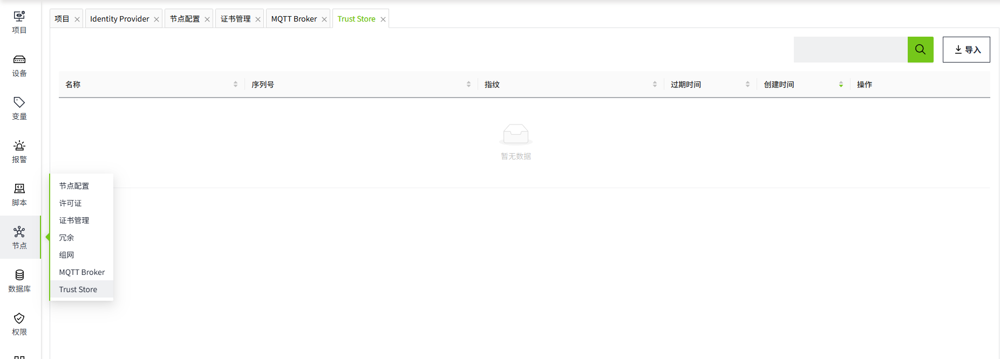
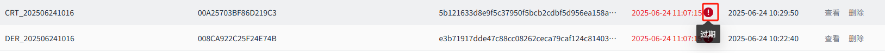

# Trust Store

**Trust Store** 用于展示和管理系统中的数字证书，包括查看证书信息、导入新证书、删除证书等操作。

Trust Store 中上传的是包含公钥的受信任根证书或中间证书，用于验证远端证书的可信性。

在建立连接（如组网）时，系统会检查远端证书的证书链是否可以通过 Trusted Store 中的任一证书进行验证。

如果远端证书本身，或其证书链中的任意上级证书已存在于 Trusted Store 中并可建立有效的信任链，则该远端证书将被视为可信。

点击 **“节点”->“Trust Store”**，显示证书列表。

距离证书过期时间<=30天时，列表中“**过期时间**”会显示为红色，提醒用户证书即将过期，需要及时更新证书。

当证书过期后，会在过期时间后面显示“**过期**”提示。

## 导入证书

点击“**导入**”按钮，在弹出的文件选择窗口中选择证书文件。导入成功后列表中自动显示新证书。

支持的证书格式：

1. `.der`
2. `.cer`
3. `.pem`
4. `.crt`

## 查看证书详情

点击证书的“**查看**”按钮，弹出证书详细信息窗口，查看证书的详细内容和属性。

## 删除证书

在证书列表对应证书的“**删除**”按钮，弹出确认对话框，确认删除后，证书将从系统中移除。

#### 注意事项

- 证书过期后可能会导致系统安全风险，请及时更新。
- 删除证书前请确保不影响系统正常运行。